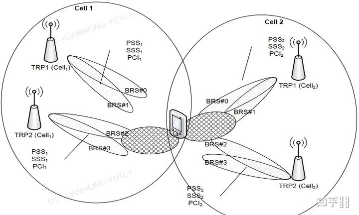

# Learning From 3GPP 38.864

## A. introduction

Various techniques in time, frequency, spatial and power domains are studied.

## B. Index

[Time domain](#c-in-time-domain)
[Frequency domain](#d-in-frequency-domain)
[Spatial domain](#e-in-spatial-domain)
[Power domain](#f-in-power-domain)
[Higher Layer](#higher-layer-aspects-for-nwes)

## C. In time domain

### A-1.Adapting transmission / reception of common channels/signals

公共信号和信道的传输或随机接入信号的接收可能会限制 gNB 使用（更深的）睡眠模式来节省能源的能力。
技术 A-1 调整下行链路公共和广播信号的传输模式（如果适用），例如 SSB/SI/寻呼/小区公共 PDCCH，和/或传输模式/上行链路随机接入机会的可用性。 传输模式的调整包括改变周期、时间资源位置和省略特定信号/信道。 可以半静态或动态地调整传输模式。

[5G NR的物理信号与信道](./5GNR_phy_signal.md)

1. A-1-1: 简化SSB，例如只有PSS，只有PSS和SSS没有PBCH，或者PSS和SSS有部分PBCH。
   * 必要情况下，通知UE使用简化版SSB的信令机制。
   * 对SSB的更改可能会影响SI获取、初始接入、RRM/RLM测量以及UE的移动性， 传统UE可能不支持该技术。
   * 只有当传统UE不使用载波时，才可以为载波启用A-1-1。
2. A-1-2：可以跳过一个或多个公共信号/信道的传输时机，例如SIB1和SSB。 由于SSB数量减少，访问延迟增加。
3. A-1-3：公共信号和/或上行链路随机接入机会的较长周期的配置/适配；
SSB 周期，基线 20ms，支持的最大值 160ms，模拟假设 640/1280ms；
当流量发生和负载增加时，用户感知吞吐量（UPT）显着降低。
4. A-1-4：寻呼资源以紧凑方式分组的寻呼增强。通过将 PF 内连续 PO 的数量增加 M 倍，同时将 PF 密度降低 M 倍来增强寻呼。这使 PO 的总数在 DRX 周期内保持不变。
5. A-1-5：动态调整[PRACH](./5GNR_phy_signal.md#1初始接入信道)的周期和出现
6. A-1-6：通过 SSB 调度 SIB1，SIB1 没有 PDCCH，重复周期为 20ms.

### A-2 Adaptation of UE specific signals and channels

半静态配置的UE特定信道/信号可能需要gNB在激活时执行周期性传输或接收。除了定位RS（PRS，positioning RS）,UE的特定信号、信道的配置是BWP特定的。当前规范允许gNB以UE特定方式使用DCI（PDCCH传输）动态激活/停用CG-PUSCH、SPS、CSI-RS、CSI报告、SRS。
技术A-2旨在减少或省略在小区的低活动、非活动时段期间用于UE特定资源的时间机会。UE特定资源的潜在列表包括周期性、半静态CSI-RS、组公共/UE特定PDCCH、SPS PDSCH、携带SR的PUCCH、携带CSI报告的PUCCH、PUSCH、携带用于SPS的HARQ-ACK的PUCCH、CG-PUSCH、SRS、定位遥感（PRS）。等
UE可以利用与流量相关的信息来辅助网络以便网络可以优化其调度并活得更多的睡眠机会。

### A-3 UE wake up signal （WUS） for gNB

技术 A-3 使 UE 能够发送上行链路唤醒信号(用于唤醒基站进入激活状态)，以请求将小区从无或减少的传输/接收活动转换为信道/信号的活动传输或接收。 该技术可以应用于处于一个或多个[RRC状态的UE](./RRC_state.md#rrc-状态)。 技术 A-3-1 的 UE 唤醒信号 (WUS) 可用于触发 SSB/SIB 传输。 它可用于通过技术 A-5 触发 SSB/SIB1 传输。 它还可以用于触发 gNB 以技术 A-4 唤醒。

在 WUS 的支持下，gNB 可能处于非活动状态（例如，它既不发送也不接收信号/信道，或者它只发送和接收有限的信号）。 gNB 可以在从 UE 接收到上行链路信号后转变为激活以发送或接收信道/信号，称为技术 A-3-2。

该技术的规范影响可能包括：

* 上行链路唤醒信号/通道的设计;
* 唤醒信号/信道的信令细节，如果需要，下行链路信号/信道设计/程序用于承载有关唤醒配置的信息；
* 触发 WUS 的条件，
* 在 WUS 传输之前需要的 DL 同步和 UE 测量机制，
* UE 的帮助信息，以帮助 gNB 进行唤醒操作，
* 传输 WUS 后的 UE 行为/过程，
* 关于如何通知 UE 关于小区活动或缺乏活动的机制。

### A-4 Adaptation of DTX/DRX

目前，gNB 可以使用减少的下行链路传输/上行链路接收活动，而无需明确的小区 [DTX/DRX](./BWP%26DRX.md)模式，由于 UE DRX 配置和任何配置的传输/接收（例如公共信道/信号）而受到限制。 目前，C-DRX 是按 UE 配置的。 不同 UE 的 DRX 周期或偏移量的对齐只能通过 RRC 完成。 在 UE DRX 关闭期间，UE 不期望监听 PDCCH，但允许它根据配置的资源（例如使用 PUCCH、RACH、SR 或 CG-PUSCH）发起 UL 传输。 跨多个 UE 的 DRX 模式的对齐/省略可以通过 gNB 实现来实现。
技术 A-4 旨在提供通知 UE 小区是否保持不活动的机制。 这可能包括对 UE DRX 配置的增强，例如 对齐/省略 DRX 周期或开始 DRX 偏移，对于处于连接模式或空闲/非活动模式的 UE，可能允许更长的小区不活动机会。 在小区DTX/DRX期间，小区可能没有发送/接收或者仅保持有限的发送/接收。 例如，小区不需要发送或接收一些周期性信号/信道，例如公共信道/信号或UE特定信号/信道。

### A-5 adaptation of [SSB/SIB1](./SIB.md) including on-demand SSB/SIB1

当前支持：

* 当前规范支持带内 CA 的无 SSB/SIB1 操作，其中 UE 从传输 SSB 和 SIB1 的另一个带内小区检索系统信息并可以基于另一个带内小区执行同步。当前规范支持高达 160 毫秒的 SSB 周期配置。

技术规范：
A-5-1：对于非CA，UE可以从其他关联的载波/小区获得系统信息并从其他关联的载波/小区同步和/或从小区上传输的信号同步。一个简化的 SSB 可能会在小区上传输。 例如。 一个 4 符号的 Discovery 信号。
A-5-2：支持按需SSB/SIB1传输，使小区不活动时间更长，实现网络节能。 服务小区的 SSB/SIB1 传输可以按需触发，例如 由UE。

### SCell without SSB in inter-band CA (RAN2)

带内 CA 中没有 SSB 的 SCell 被认为是基线，即，对于没有传输 SS/PBCH 块的服务小区，UE 根据 SpCell 上 SS/PBCH 块的接收获得与服务小区的时间和频率同步 或小区组的SCell。
该解决方案的可行性在 RAN1 范围内。

### NES Cell without SIB/SSB (RAN2)

* 没有 SIB 的非锚定 NES 小区的概念仅适用于多载波场景，其中 UE 在锚定小区和一个或多个非锚定 NES 小区的覆盖范围内。
* 锚小区是UE能够接收SSB、系统信息和寻呼的小区。
* 没有SIB的非锚定NES小区是UE不能接收SIB的小区。
* 没有 SSB 和 SIB 的非锚定 NES 小区是 UE 既不能接收 SSB 也不能接收 SIB 的小区。
* 根据设计，访问可能仅通过锚小区发生，也可能直接在非锚 NES 小区中发生。 如果支持直接接入非锚定NES小区，锚定小区发送的SIB也可以包含接入非锚定NES小区的必要信息。
* 如何以及是否可以通过另一个小区确定没有SSB和SIB的非锚定NES小区的定时、同步和QCL关系在WI内决定。
* UE 驻留在锚小区上，而不是在没有 SIB（或没有 SSB 和 SIB）的非锚 NES 小区上。
* 不支持在没有 SIB 的非锚定 NES 小区或没有 SSB 和 SIB 的非锚定 NES 小区上进行寻呼。

该解决方案的可行性在 RAN1 范围内

## D. In frequency domain

### B-1 Multi-carrier energy savings enhancements

根据当前规范，切换命令是[支持PCell切换](./Pcell%26Scell.md)。

B-1-1技术（for CA）支持无SSB的Scell 的带间载波聚合（CA）。在某些带间Scell中没有SSB传输。同步是从具有SSB传输的其他小区或具有简化信号传输的同一小区获取，也是为了快速激活和去激活 SCell。启用带间 SSB-less SCell 操作，其中可能包括 UE/gNB 触发正常 SSB 传输和/或参考信号的机制，如果需要，在 SCell 上进行快速接入，可以接收按需上行链路触发信号 在带间无 SSB 小区或另一个载波/小区。 在无 SSB 的 SCell 中可以支持 RACH 传输机会。
技术 B-1-2 支持动态 PCell 切换，其中可以为一组 UE 动态指示公共主小区。

### B-2  Adaptation of bandwidth part of UE(s) within a carrier

R-17支持 UE特殊的BWP配置和交换，对于SPS PDSCH接收，type-2 CG PUSCH 传输和PUSCH上的SP-CSI报告，一旦BWP被切换，他们应该被激活DCI重新激活。
技术B-2支持增强功能，以实现UE组通用或小区特定的BWP配置和/或切换。还支持增强功能以启用SPS PDSCH接收/ Type-2 CG PUSCH 传输/SP-CSI在PUSCH上报告，而无需在BWP切换后重新激活。

### B-3 Adaptation of bandwidth of UE(s) within a BWP

目前BWP的带宽是半静态配置的，不能动态改变给定的BWP的带宽。当前的BWP框架允许UE配置默认BWP根据定时器切换。可以通过配置和调度gNB来减少BWP内的频率资源。
技术B-3支持增强功能，以启用组公共信令以适应活动 BWP 的带宽并继续在同一 BWP 中运行。 活动 BWP 中的某些频率资源可能会被停用。

## E. In spatial domain

### C-1 Adaptation of spatial elements

根据传统MIMO过程，空间元素的适配通过RRC重新配置更新（例如CSI-RS重新配置）以半静态方式实现。此外，当前框架允许UE配置有多个CSI-RS资源，，其中这些CSI-RS配置可以关于不同数量的空间天线端口或天线元件。通过CSI报告关于不同数量的可用空间元素，gNB能够动态调整当前规范中用于PDSCH传输的空间元素的数量。CSI-RS 和 CSI报告配置是BWP特定的，并且BWP适配框架可以用于适配具有多个BWP和动态BWP切换的UE。
与空间元素适配相关的潜在增强的指示可以帮助UE适配已配置的CSI-RS配置，例如CSI-RS的动态/半持久开关或重新配置CSI-RS配置，关于适配的数量/端口数。
技术C-1 旨在增强空间元素的动态适应性，例如gNB在传输或接收信道和信号中的活动收发器链或活动天线面板数量。

## Adaptation of TRPs in mTRP operation

技术C-2旨在支持当UE配置有多个TRP时可以通知UE的TRP激活/去激活。该技术旨在动态调整传输和/或接收信号和通道的TRP数量。

TRP（发送接收点）概念和gNB概念：

## F. In Power Domain

### D-1 Adaptation of transmission power of signals and channels

根据当前规范，SSB 参考功率 ss-PBCH-BlockPower 在 SIB1 中定义。 作为(NZP)CSI-RS和SSB之间的功率偏移的powerControlOffsetSS，以及作为PDSCH和(NZP)CSI-RS的功率偏移的powerControlOffset，经==由RRC信令半静态的配置==。PDSCH和CSI-RS的功率偏移配置是特定于BWP的。当前规范允许gNB调整PDSCH传输功率。
技术D-1旨在通过增强与UE的相关配置（例如考虑潜在功率适配的功率偏移）和/或增强UE反馈（例如CSI报告）来动态适配下行链路信号和信道的传输功率或PSD）协助NW节能运行。该技术可应用于PDSCH，CSI-RS，DMRS、广播信道、信号（例如，SSB/SI/寻呼）中的一个或多个。用于更新各种信号和信道之间的功率偏移值的增强。例如，CSI-RS 到 SSB，或 PDSCH 到 CSI-RS，包括使用低层信令。

### D-2 Over the air digital pre-distortion（无线数字预失真）

gNB可以实施数字预失真（DPD）以标准透明方式补偿发射机的非线性损失。
技术 D-2 支持 gNB 的无线数字预失真。 在空中 gNB 数字预失真中，UE 通过处理训练信号并报告 gNB 数字预失真所需的信息，协助 gNB 减少 PA 引入的非线性损失。

### D-3 Tone reservation

TR（Tone Reservations） 在 OFDM的信号中的预定的子载波位置插入预定的冗余数据，从而降低OFDM信号的峰均比，达到省电的效果。
仅当UE执行包括承载TR信号的子载波的资源的传输或接收时，UE才被通知承载TR信号的子载波用于速率匹配目的。gNB 可能能够通过适当的信号和信道调度实现 PAPR 降低。
PAPR：峰均比

TR 在 OFDM的信号中的预定的子载波位置插入预定的冗余数据，从而降
预留子载波法最初由Tellado提出，其主要思想是在所有的子载波中，只选择一部分用于传送数据信息，而在其余子载波上插入预定的冗余数据，通过在频域设计冗余数据，经过IFFT变换后，在时域抵消峰值来抑制PAPR

### D-4 PA power bias adaptation

在低负载的情况下，PA 可以调整/减少其回退，从而降低 PA 功耗。 PA 回退会影响不需要的带内和带外发射。 gNB 可能能够以规范透明的方式实施 PA 回退适配。
技术 D-4 支持在无负载或低负载的情况下修改和/或减少功率放大器 (PA) 回退。 该技术可实现几毫秒的 PA 回退适应，并协调相邻小区之间的 PA 回退适应

### D-5 UE post-distortion

技术 D-5 支持 UE 执行接收信号后失真处理（例如，将“反转”非线性的非线性均衡阶段）以对抗来自发射机的非线性损失。 该技术还考虑了对参考信号或信息传输的增强，以帮助 UE 执行失真后处理。

虽然 DPD 在发射器上完成，但在接收器端进行非线性处理的数字后失真 (DPoD) 也可以减轻发射器 PA 的非线性。
DPoD 将允许发射机在其非线性状态下工作，提高超量程速率和能效。
DPoD 可以用在 UE 的接收器上，以提高 gNB 的功率效率，从而提高 gNB 的能源效率，或者它可以用在 gNB 的接收器上（从而提高 UE 的功率效率）。 DPoD 方法可以与 DPD（或 OTA-DPD）结合使用，其中可以优化 DPD 以减少带外发射，而 DPoD 负责处理带内失真。 这也将有助于性能改进受到严格的 OOBE 要求限制的场景和条件。

## Higher Layer aspects for NWES

### Cell selection / reselection

为了向后兼容，需要允许网络节能小区（NES cell）防止传统UE驻留。NES cell应该能够配置是否阻止传统UE，同时允许支持NES cell的UE驻留。
NW 应该能够配置支持 NES 的 UE，以便在特定频率上优先/降低特定 NES 小区或 NES 小区的优先级。 根据指定的 NES 技术，现有的小区（重新）选择机制是否足够，留给 WI 阶段。
从 RAN2 的角度来看，在存在 NES 小区的情况下，可以通过小区选择/重选技术处理传统 UE 和支持 NES 的 UE。

### Connected mode mobility

在 NES 模式切换期间，可以通过以下方式增强 CHO 框架来更快地切换 UE：
1.根据源/目标小区的NES模式评估条件切换条件，
2.如何向UE指示CHO评估的触发取决于WI阶段。
每当触发来自源小区的移动性时，也可以考虑目标小区的 NES 模式，例如，以避免 UE 在任何其他小区可用时选择以 NES 模式运行的小区。
从 RAN2 的角度来看，CHO 增强是可行的。
RAN2 不考虑 Group HO（优化 Rel-15 HO 过程）和带组信令的 BWP 适配

### Inter-node Beam Activation

该机制允许 NG-RAN 节点请求相邻的 NG-RAN 节点打开某些已停用的 SSB 波束，例如在容量层中。 通过这种机制，NG-RAN 节点（例如，在覆盖层中）可以请求重新激活之前停用的 SSB 波束。

==Has been agreed on RAN3 #119 meeting==
==Support beam level activation over Xn and F1.==

### Paging Enhancements

这种机制允许 NG-RAN 节点寻呼，例如 限制区域中的固定 UE。 例如，可以在某些 SSB 而不是小区内的所有 SSB 中进行寻呼。
