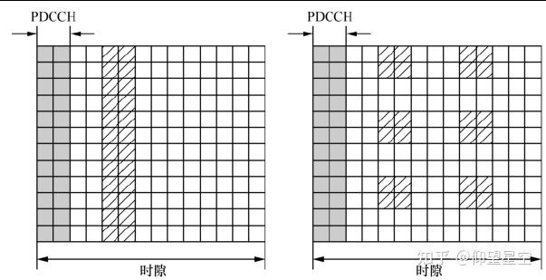
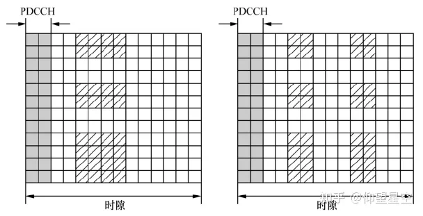
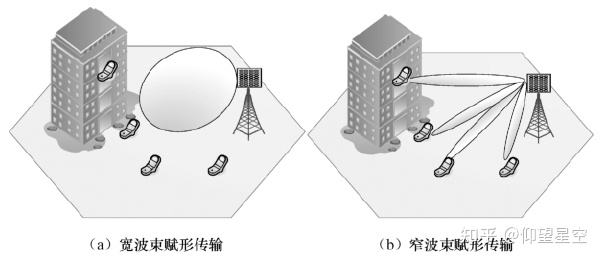
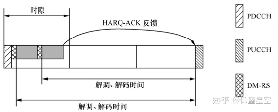
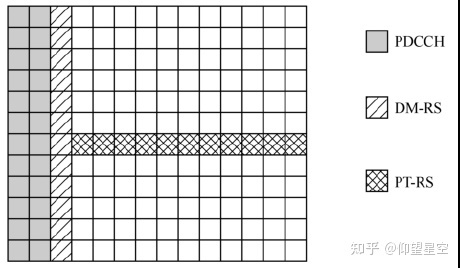
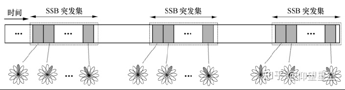
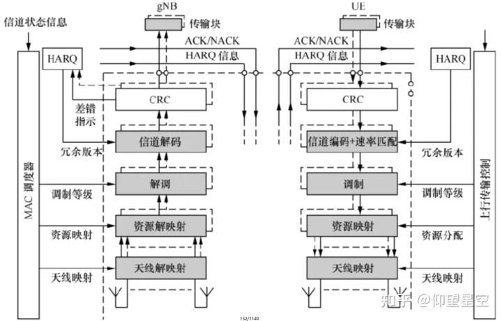
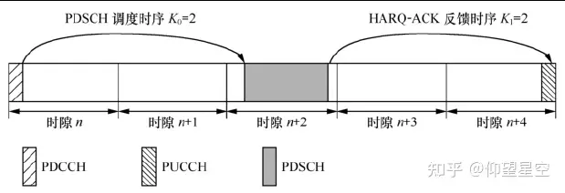

# 5G NR的物理信号和物理信道

## 1. 物理信号

从功能上划分：

NR下行物理信号包括信道状态信息参考信号（Channel State Information Reference Signal，CSI-RS）、解调参考信号（DM-RS）、时频跟踪参考信号（Tracking Reference Signal，TRS）、相位噪声跟踪参考信号（Phase noise Tracking Reference Signal，PT-RS）、RRM测量参考信号、RLM测量参考信号等。

NR上行物理信号包括探测参考信号（Sounding Reference Signal，SRS）、解调参考信号（DM-RS）、相位噪声跟踪参考信号（PT-RS）等。其中，上行DM-RS和PT-RS与下行的设计基本相同。

参考信号的设计规范：
（1）避免持续发送的周期性信号。所谓持续发送，是指不经系统配置即发送，也无法关闭的信号，例如LTE的CRS。
（2）物理信号占用的时频资源可灵活配置.
（3）支持大规模波束赋形传输。

### 1. 信道状态信息参考信号（CSI-RS）

CSI-RS的天线端口数最高可以达到32，包括1、2、4、8、12、16、24和32，支持大规模天线技术的CSI测量，CSI-RS的时频资源位置由高层信令灵活配置，包括所占用的OFDM符号和PRB。CSI-RS可以在一个时隙内的任意OFDM符号上传输，可以在BWP内任意的连续PRB内传输（最小带宽为24个PRB），对于给定的天线端口数量，CSI-RS在一个PRB内的图样也不再有固定的形式，而是由基站根据可用时频资源灵活配置。例如，图1和图2给出了32端口和24端口在一个PRB内的两种图样。实际上可以配置的图样远远多于两种。

CSI-RS可以进一步划分为波束管理CSI-RS和CSI获取CSI-RS：

波束管理CSI-RS：用于波束管理过程中的波束测量和上报，UE接收波束赋形传输的CSI-RS，对其质量进行测量（接收信号功率），选出最佳的发送和接收波束，所以波束管理CSI-RS仅需要测量接收功率（PSRP）。

CSI获取CSI-RS：CSI获取CSI-RS的传输分为两种情况。其一是宽波束赋形传输，CSI-RS的每个天线端口都是宽波束赋形传输，覆盖整个小区的角度范围。为获取完整的CSI，这种传输方式需要较大的端口数量（最大32端口）。其二是窄波束赋形传输，CSI-RS经过波束赋形以获得赋形增益，增加覆盖距离。此时每个天线端口均为窄波束传输，因此空间覆盖的角度范围较小。为了覆盖一个小区内的所有UE，往往需要配置并传输多个波束赋形CSI-RS，但是每个波束赋形CSI-RS包含的天线端口数量可以较少，两种CSI-RS的传输方式的示例见图3。

### 2.时频跟踪参考信号（TRS）

LTE系统中CRS在每个子帧发送，UE可以通过测量CRS实现高精度的时频同步。持续周期性发送的参考信号会带来前向兼容性问题和不必要的功率浪费，因此NR引入了可以根据需要配置和触发的TRS实现时频精同步。因为CSI-RS的结构和配置方式都足够灵活，NR将一种特殊配置的CSI-RS作为TRS。具体地，NR将包含N（2或4）个周期性CSI-RS资源的CSI-RS资源集合（CSI-RS Resource Set）用于实现TRS的功能，其中每个CSI-RS资源都是一端口，单独占据一个OFDM符号。UE将集合内的不同CSI-RS资源的天线端口视为同一个天线端口。时频精同步需要UE持续地进行跟踪和测量，因此TRS以周期性传输为主，在部分特殊场景下配合使用非周期TRS。

### 3.解调参考信号（DM-RS）

DM-RS作用是使用DM-RS进行上下行业务信道和控制信道进行信道估计，实现相干解调。DM-RS与数据采用相同的预编码处理，因此接收端从DM-RS估计出来的信道直接用于数据解调，无须额外指示预编码相关的信息。为了降低解调和解码时延，NR数据信道（PDSCH/PUSCH）采用了前置DM-RS的设计。在每个调度时间单位内，DM-RS的位置都尽可能地靠近调度的起始点。UE接收到PDCCH及其调度的PDSCH之后，需要在一定的时间内完成解调和解码，以便在基站为其分配的PUCCH资源上反馈HARQ-ACK信息。如图4所示，前置DM-RS使得UE能更早完成解调和解码，因而降低了传输时延。

为了兼顾对中高移动速率的支持，NR在前置DM-RS的基础上，可以为UE配置附加DM-RS。每一组附加DM-RS的图样都是前置DM-RS的重复。因此，与前置DM-RS一致，每一组附加DM-RS最多可以占用两个连续的符号。根据移动速率的不同，基站可以为UE配置1～3组附加DM-RS符号。

### 4.相位噪声跟踪参考信号（PT-RS）

相位噪声（Phase Noise，PN）主要由本地振荡电路引入。相位噪声会破坏OFDM系统中各子载波之间的正交性，引入子载波间干扰。同时，相位噪声在所有子载波上引入相同的公共相位误差（Common Phase Error，CPE），从而导致所有子载波上的调制星座点以固定角度旋转。相位噪声在高频段对系统性能有明显影响，但是NR在高频段使用的子载波间隔更大，相位噪声引起的子载波间干扰对解调性能影响不大，因此NR设计了PT-RS，主要实现对CPE的估计和补偿。

PT-RS在业务信道占用的时频资源范围内传输，配合DM-RS使用。PT-RS映射在没有DM-RS的OFDM符号上，估计出各个OFDM符号上的相位变化，用于相位补偿。由于CPE在整个频带上相同，理想情况下，一个子载波用于传输PT-RS就可以达到CPE估计和补偿的目的。然而，由于干扰和噪声的影响，仅用一个子载波估计CPE可能会存在较大的估计误差，因而需要更多的子载波来传输PT-RS，以提升CPE估计的精度。NR采用若干个PRB内占用一个子载波的均匀密度传输PT-RS。频域密度与调度带宽大致成反比例，调度带宽越大，密度越低。时域内，PT-RS可以在每1/2/4个OFDM符号占用1个OFDM符号传输。PT-RS的时域密度与业务信道所使用的MCS等级相关，MCS等级越高，时域密度越大。这是因为高等级MCS的解调性能对相位噪声更敏感，需要相对更精确的相位噪声估计和补偿。PT-RS图样的示例如图5所示，这个例子中，PT-RS在一个PRB内的每个OFDM符号上传输。

### 5.探测参考信号（SRS）

SRS的主要功能是上行信道状态信息获取、下行信道状态信息获取和波束管理。获取上行信道状态信息的SRS按照对应的传输方案（码本和非码本）不同可以进一步分为两种，因此NR支持4种不同功能的SRS。不同功能的SRS以SRS资源集合的方式进行管理和配置。基站可以为UE配置多个SRS资源集合，每个资源集合由高层信令配置其功能。

NR SRS的用途相对于LTE得到了扩充，同时由于用户数量和业务量的提升，NR系统对SRS资源的需求量更大，因此NR允许每个上行时隙的最后6个符号用于SRS传输。每个SRS资源在一个时隙内可以占用1个、2个或4个连续的OFDM符号。允许SRS在多个OFDM符号上传输的目的是扩展上行覆盖。同一个SRS资源在多个OFDM符号上可在相同的子带上重复传输，也可以在不同的子带间跳频传输。

一个SRS资源可以包括1个、2个或4个天线端口，由基站根据UE的能力配置。多个天线端口之间以CDM或者FDM+CDM的方式复用。频域内SRS传输采用梳状结构，SRS占用的子载波间的间距可以配置为2或者4。

UE可以采用赋形或者非赋形方式传输SRS。对于非码本传输，UE对下行信道进行测量，利用信道互易性获得上行的赋形权值，并传输对应波束赋形的SRS。对于波束管理，SRS要用UE的候选发送波束分别发送，由基站进行测量并选择合适的UE发送波束。对于码本传输方案，SRS是否赋形取决于基站的配置和UE的实现结构。如果基站只为UE配置了一个SRS资源用于码本传输，UE通常用宽波束传输该SRS，数据传输的波束赋形（预编码）由基站以TPMI（Transmission PMI）的形式指示。如果基站为UE配置了2个SRS资源，则UE可以用2个不同的窄波束分别传输这2个SRS资源，数据传输的波束赋形由基站指示给UE的SRS资源索引（SRS Resource Indicator，SRI）和TPMI共同确定。

在TDD系统中，SRS的一个重要功能是获取下行信道状态信息。UE的接收链路往往多于发射链路，因此UE一次发送的SRS不能获得完整的下行信道信息。这种情况下，NR支持UE的SRS天线切换，即UE按照预定义的规则，在不同的时间用不同的天线发送SRS，以使基站能获得完整的下行信道状态信息。

## 2.物理信道

物理信道对应于一组特定的时/频资源，用于承载高层映射的传输信道。每个传输信道均映射到一个物理信道，具体的映射关系如图6和图7所示。从图中可以看到，有一些物理信道不承载传输信道，这些信道称为控制信道。物理下行控制信道（Physical Downlink Conrol Channel，PDCCH）承载下行控制信息（Downlink Control Information，DCI），用于为UE提供下行接收和上行传输的必要信息，例如资源分配信息等。物理上行控制信道（Physical Uplink Control Channel，PUCCH）承载上行控制信息（Uplink Control information，UCI），用于向基站报告UE的状态，如HARQ接收的状态、信道状态信息等。

NR定义的物理信道包括以下几个：

* 物理下行共享信道（Physical Downlink Shared Channel，PDSCH）主要用于下行单播数据的传输，也可以用于寻呼消息和系统消息的传输。PDSCH在天线端口1000～1011上传输。
* 物理广播信道（Physical Broadcast Channel，PBCH）承载UE接入网络所需的最小系统信息的一部分。PBCH的天线端口为4000。
* 物理下行控制信道（PDCCH）用于传输DCI，主要是UE接收PDSCH和传输物理上行共享信道（Physical Uplink Shared Channel，PUSCH）所需的调度信息，也可以传输时隙格式指示（Slot Format Indicator，SFI）和抢占指示（Preemption Indication，PI）等。PDCCH的天线端口为2000。
* 物理上行共享信道（PUSCH）对应于PDSCH的上行物理信道，用于传输上行业务数据，还可以用来承载UCI。PUSCH在天线端口1000～1003上传输。
* 物理上行控制信道（PUCCH）承载UCI，反馈HARQ-ACK信息，指示下行的传输块是否正确接收；上报信道状态信息；在有上行数据到达时请求上行资源。PUCCH的天线端口为2000。
* 物理随机接入信道（Physical Random Access Channel，PRACH）用于随机接入过程，天线端口为4000。
总结：控制信道传输信令（控制信息）；共享信道传输数据（数据信息）；初始接入信道（初始小区接入）

### （1）.初始接入信道

UE开机或者移动到新的小区覆盖范围之后，需要通过下行同步信道获得与网络的下行同步，包括时间和频率的同步、获取小区的物理小区标识（Physical Cell Identity，PCID）、读取小区的广播信息，从而获取小区的系统信息以确定后续的操作，例如驻留、小区重选、发起随机接入等。

NR的设计目标是支持100GHz以下的频段，其中既包括传统的无线通信所使用的低频频段，也包括毫米波频段。即便是在低频频段，其工作频段也可能高于现有4G系统所使用的频段，例如3.5GHz。频率升高以后，网络覆盖变小。NR采用大规模天线技术有效地解决了高频段带来的覆盖变小的难题。通过大规模天线的波束赋形增益，业务信道的覆盖范围得以普遍的提升。尤其对于毫米波频段，必须通过波束赋形技术才能补偿高频段的路径损耗，使得通信距离达到有意义的范围。同理，下行同步信道的设计也必须考虑覆盖范围的要求，使之能与业务信道的覆盖范围相匹配。NR采用波束扫描技术提升下行同步信道的覆盖范围。

波束扫描是指用波束赋形的方式发送下行同步信道。但波束赋形的问题是，只有在波束覆盖范围内的UE才能接收波束赋形之后的下行同步信道，波束覆盖范围之外的UE无法可靠接收。下行同步信道是一种广播信道，要求小区内的UE都能接收，一个覆盖角度有限的波束实际上不能满足小区全覆盖的要求。解决的办法就是用多个波束在不同方向重复发送下行同步信道，这些波束合并起来可以覆盖整个小区。通常多个波束是在不同的时间轮流发送的，因此被称为波束扫描。

下行同步信道包括主同步信号（Primary Synchronization Signal，PSS）、辅同步信号（Secondary Synchronization Signal，SSS）和PBCH。因为PSS、SSS和PBCH需要按照相同的方式进行波束扫描，NR将PSS、SSS和PBCH组合起来定义为一个同步块（Synchronization Signal/PBCH Block，SSB），波束扫描以SSB为单位进行。

图8给出了SSB波束扫描的配置方案。一个扫描周期内的SSB构成一个SSB突发集，扫描周期即是SSB突发集的发送周期。一个SSB突发集内不同编号的SSB可以用不同方向的波束发送，形成扫描波束。同时，SSB突发集以一定的周期进行重复发送，不同发送周期内有相同索引的SSB所采用的波束方向相同。

一个SSB突发集内的SSB的个数主要取决于两个因素：系统开销和覆盖的要求。SSB的个数越多，基站就可以用更多更窄的波束发送SSB，从而获得更大的波束赋形增益和更好的覆盖效果（波束越窄，需要的天线数量越多），但是相应的系统开销也等比例地增加。NR分频段定义了允许的最大的SSB个数。随着频点的升高，对于提升SSB覆盖的需求增强，允许的SSB数目也增大。在实际的网络中，基站可以根据系统频点、用户分布等因素选择实际发送的SSB的个数和波束方向。

UE开机获得下行同步，读取完系统广播消息之后，如果UE需要和基站建立无线链路，例如UE要进行网络注册、有上行数据要发送，或者基站通过寻呼消息通知UE有下行数据到达，UE需要发起上行随机接入过程，建立与基站的连接，随后才能进行常规的数据传输和接收。

随机接入过程也要考虑覆盖范围，也就是说，基站要采用接收波束赋形获得赋形增益，UE也应采用波束赋形进行发送，才能满足高频段的覆盖要求。由于随机接入过程是UE第一次与基站进行通信，之前没有和基站的交互，无法通过预先的信令交互完成波束的配置。NR定义了随机接入过程中的4个消息所应使用的波束发送和波束接收。

### (2).上下行控制信道

上下行业务信道的传输需要相关的下行控制信令辅助，包括上下行传输的资源分配信息、传输块大小、调制等级和天线端口等。下行控制信令也包括上行传输的功率控制信息、SFI和PI等。下行控制信令在PDCCH上传输。NR PDCCH设计要求包括以下3个方面。

灵活的资源配置。为避免类似于LTE的PDCCH在小区之间产生的持续干扰，NR PDCCH的资源配置应更加灵活，以支持小区间干扰协调。此外，NR的系统带宽可以达到400MHz甚至上GHz，PDCCH仅占用部分带宽即可以提供足够的容量，NR的PDCCH不必占用整个系统带宽。基于这些考虑，NR以控制资源集合（Control Resource Set，CORESET）为单位配置资源，CORESET占用的PRB个数以及PRB位置均可根据网络部署情况灵活选择。
支持低时延业务。LTE的PDCCH固定在每个子帧的前几个符号上，这意味着在有紧急业务（如uRLLC）待发送的情况下，基站也只能等到下一个子帧才能传输PDCCH，无法满足此类业务的需求。为解决该问题，NR在一个时隙内允许有多个PDCCH发送机会[12]，即允许在一个时隙内多个符号位置上发送PDCCH。灵活的PDCCH发送位置与微时隙调度结合，可以有效地支持低时延业务。在低时延业务要发送时，通过一个时隙内最早的PDCCH发送机会调度一个微时隙传输，将调度和传输的时延压缩到最短。
大规模天线传输。为达到甚至超过业务信道的覆盖范围，PDCCH的设计也应发挥大规模天线技术的优势。
下行控制信令的可靠高效传输是上、下行数据传输的前提条件，因此当上、下行数据信道通过大规模天线技术获得了速率和覆盖的提升时，控制信道的覆盖也需要获得与之匹配的提升，否则下行控制信道会成为覆盖的瓶颈。PDCCH多天线方案主要有如下几种：

波束赋形、发射分集、多用户多入多出（Multi-user Multiple-Input Multiple-Output，MU-MIMO）技术、空分复用

### （3）.上、下行业务信道

下行共享信道（DL-SCH）是下行数据的主要传输信道，映射到PDSCH上进行传输。图9给出了PDSCH传输的简化的处理过程。DL-SCH产生的传输块添加CRC比特后，进行LDPC编码和速率匹配。CRC用于接收端的差错检测，LDPC则用于纠正数据经过无线信道后产生的差错。速率匹配除了按照资源量产生对应数量的编码后比特外，还用于生成不同的冗余版本。冗余版本由HARQ协议控制。速率匹配之后的编码比特经过调制、资源映射和天线映射后，在为PDSCH分配的时频资源以及天线端口上发出。传输块大小、MCS、时频资源和天线端口等都由调度器控制。

上行共享信道（UL-SCH）是上行数据的主要传输信道，映射到PUSCH上进行传输。图10给出了PUSCH传输的简化的处理过程。上行的处理过程与下行基本相同。需要注意的是，上行传输的传输块、MCS、时频资源和天线端口都由基站的调度器负责分配。

NR的PDSCH和PUSCH均以DM-RS为解调导频，DM-RS和数据的预编码相同，因此基于DM-RS估计出的信道可以直接用于数据的解调。为满足上、下行的峰值速率要求，PDSCH和PUSCH单用户最多分别支持8流和4流传输。多用户MIMO调度时的一个UE最多支持4流传输。PDSCH和PUSCH在支持MU-MIMO的情况下最多可以配置12个正交DM-RS端口。结合高精度（Type Ⅱ）CSI反馈方案，下行传输的频谱效率相对于LTE有显著的提升。PDSCH传输不支持显式的分集方案，但是基站可以通过实现方式支持，如预编码矩阵轮循方案，并且NR协议支持预编码矩阵轮循方案相关的CSI反馈。

PDSCH和PUSCH的DM-RS采用了DM-RS前置设计，即DM-RS尽量靠近调度资源的时域起始位置，目的是降低终端解调、解码的时延。在此基础上，可以通过配置附加DM-RS来支持高速移动的UE。NR引入了相位跟踪参考信号（PT-RS）用于相位噪声的跟踪和补偿，主要用于高频段，因为高频段的相位噪声影响更加明显。

PDSCH和PUSCH频域资源调度类似于LTE，增加了BWP的指示。一个UE最多可以配置4个BWP（取决于UE能力），数据传输可以在4个BWP之间进行切换，通过DCI信令指示或者高层信令配置进行切换。

NR时域资源调度比LTE更加灵活。PDSCH和PUSCH的实际传输的时隙与控制信令所在的时隙之间的偏移、PDSCH和PUSCH在一个时隙内占用的符号位置，以及PDSCH与承载其HARQ-ACK比特的PUCCH之间的时隙偏移都可以在DCI中动态指示。图11中，PDSCH实际所在的时隙为调度该PDSCH的PDCCH所在的时隙偏移K0=2个时隙，PUCCH所在的时隙为PDSCH最后一个OFDM符号所在的时隙偏移K1=2个时隙。

PDSCH和PUSCH时域资源的映射类型有两种：Type A和Type B。Type A是基于时隙的调度，Type B是基于微时隙的调度。如前所述，Type B调度的主要目标是支持uRLLC业务。Type A调度的起始符号位置可以是0、1、2、3，Type B调度的起始符号位置可以是任意的符号。Type A的前置DM-RS位置固定在第3个或者第4个OFDM符号上，Type B的前置DM-RS位置总是在PDSCH或者PUSCH的第一个OFDM符号上。

在FR2，PDSCH的波束在DCI中以TCI状态（Transmission Configuration Indication State）的形式指示。考虑到PDCCH的解调以及终端侧的波束切换需要一定的时间，如果PDSCH和PDCCH之间的间隔在一定门限之上，则PDSCH采用DCI指示的波束传输；否则，PDSCH采用默认波束进行传输，该默认波束为距离该PDSCH最近的包含CORESET的时隙内编号最低的CORESET的波束。PUSCH传输没有显式的波束指示设计，其波束指示是通过SRS的指示实现的。对于基于码本和非码本的上行传输，其调度信令内可能包含SRS资源指示（SRI）域，通过该指示域，UE可以确定PUSCH传输的波束为与该SRS传输相同的波束。
