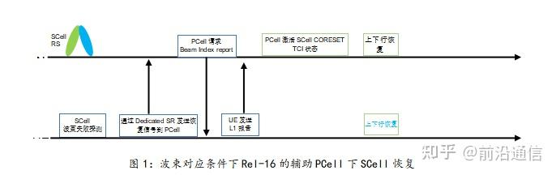
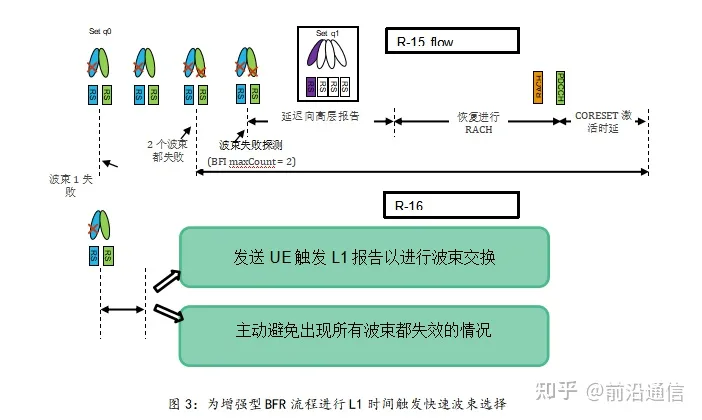

# SCell BFR(Beam failure Recovery)

对于带内CA操作，其中PCell和SCell可能共享相同的QCL，SCell的波束故障恢复可从Rel-15中的PCell BFR（ beam failure recovery ）导出。对于FR1+FR2操作，例如PCell为FR1，SCell为FR2，可能无法从PCell波束确定SCell链路质量。

SCell波束故障检测和恢复可以从现有Rel-15中派生出来，并以特定的方式执行带间CA。SCell波束故障检测（BFD：beam failure detection）可以基于SCell中调度的下行传输没有ACK/NACK反馈，或者基于SCell中的CQI报告。然而，这会导致延迟和开销。一旦检测到波束失效，可以直接在SCell恢复资源上尝试BFR，如Rel-15所示。

此外，如果SCell和PCell同时失效呢？例如，当一个UE需要同时执行2个CFRA时，需要在标准中澄清UE的行为，作为PCell和SCell的BFRQ。

如果SCell只有下行，则必须通过PCell执行SCell波束激活流程。

在SCell同时具有上下行的情况下，SCell波束激活/配对的进一步过程取决于是否假定波束对应。当波束对应可用时

* 基于来自UE的关于SCell的L1 report/MAC-CE信息，gNB经由PCell执行SCell CORESET TCI状态激活。

图1显示了建议的Rel-16解决方案，该方案利用PCell连接在波束通信下执行SCell恢复。

在没有波束对应的情况下，需要RACH流程来实现上行波束配对。利用主动PCell连接，建议如下：

* PCell触发与来自UE SCell recovery report的SSB索引相关联的动态RACH资源。

图2显示了一个高级解决方案/建议。

在Rel-15中，对于Pcell BFD RS配置，每个BWP最多支持2个BFD RS。对于Rel-16中的Scell BFR，认为每个BWP/CC最多应支持2个BFD RS。

当没有为失效的SCell确定波束时，UE行为应如下：

首先，当BFRQ在Scell中经由RACH发送时，不需要明确地向gNB指示NBI信息，因为候选波束用于接收RACH信号。因此，当BFRQ在Pcell中发送时，只要需要NBI报告，我们就只需要在报告中明确地传达NBI。

此外，当BFRQ在Pcell中发送时，UE也有必要报告在候选波束RS列表中未找到好波束的状态。没有良好波束的状态可以被莫名其妙地或明确地传达，如下所示：

* 一种莫名其妙的方法可能会在Pcell中使用两种格式的BFRQ，其中NBI字段只包含在一种格式中。当需要NBI报告但使用不带NBI字段的BFRQ格式时，向gNB指示不良波束状态。
* 显式方法在Pcell BFRQ的NBI字段中使用保留索引/位。

如果不在BFRQ中包含不好的束流状态，NBI报告可能会产生误导。例如，如果没有良好的新波束的状态，UE则必须始终报告波束索引，并且gNB将无法判断报告的波束是否满足RSRP阈值。

**通过L1时间触发快速波束选择**

考虑使用第二个特征，用于波束选择增强以降低时延和开销减少。R15基线中波束选择的一种方法是启用周期波束报告。周期性的波束报告会增加UE的开销和功耗。为了减少开销和功耗，可以支持基于L1事件的UE触发波束报告。例如，当前N个波束的集合改变时，UE仅报告前N个波束。L1事件可以指定为类似的L3事件，触发条件和阈值可以配置。响应于L1事件触发器，可以发送诸如SR之类的低开销上行信号。

下面是一个应用于增强BFR流程的L1事件触发示例。该方案的主要动机是，不必等到故障检测集中的所有波束都降到阈值以下，而是根据监测波束中的L1事件来查看gNB的早期指示。这可以使gNB在全波束失效之前主动切换到更好的TCI状态。此外，这可以是从UE侧而不是从gNB侧触发的事件，这可能导致更高的时延。使用L1事件触发的波束切换，可以缓解在耗时的Rel-15 BFR过程中链路利用率有限的问题，如图3所示。

**在CDRX中增强型波束选择**

在CDRX操作中，快速波束选择对于FR2的功率高效操作至关重要。下图显示了CDRX开启期间R-15波束选择的示例。在示例操作中，gNB在每个时隙中配置两个CORESET来监视PDCCH。为了健壮性，每个CORESET可能与不同的TCI状态相关联。

