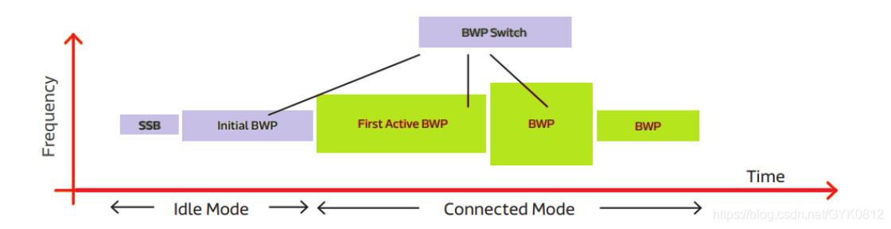
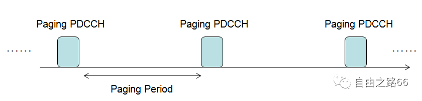
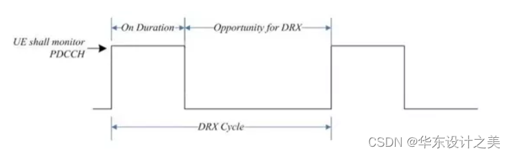

# BWP and DRX

## Power mode

## BWP：什么是5G中的BWP

==BWP（bandwidth part）==: 由于5G带宽较大，为了减少手机端的功耗，设置了BWP的概念。

BWP是整个带宽上的一个子集，每个BWP的大小，以及使用的SCS和CP都是灵活配置。DL和UL分别最多可以配置4个专用的BWP。但要注意的是，BWP的带宽必须大于等于SSB，但是BWP中不一定包含SSB。对同一个UE来说，DL或UL同一时刻只能有一个BWP处于激活状态，UE在这个BWP上进行数据的收发和PDCCH检索。

1. Initial BWP: 用于UE接入前的信息接收，主要用于接收SIB和RA相关信息，一般在Idle态时使用。存在于连接态的BWP一般都会大于Initial BWP。
2. First Active BWP: 第一个UE 专有BWP，UE可在这个BWP上进行数据的收发和PDCCH检索。
3. default BWP: UE专有BWP，是在RRCReconfiguration中配置给UE的。如果没有配置，则将Initial BWP认为是default BWP，并bwp-inactivityTimer超时之后，UE仍没有被调度，则将UE切换到default BWP。

## DRX：什么是DRX

DRX： 非连续接受主要是节省终端的功耗，通俗点，就是节省电量
广义上的DRX的理解，可以分为RRC_IDLE/RRC_INACTIVE状态和RRC_CONNECTED状态的DRX。

### IDLE DRX

空闲态的DRX又称为寻呼过程（Paging）

### Active DRX

一个典型的DRX周期如下图所示。在这个图中，“On Duration”的这段时间是UE监控下行PDCCH子帧的时间，在这段时间里，UE是处于唤醒状态的。

“Opportunity for DRX”的这段时间是DRX睡眠时间，即UE为了省电，进入了睡眠而不监控PDCCH子帧的时间。

从这个图中可以看到，用于DRX睡眠的时间越长，UE的功率消耗就越低，但相应的，业务传输的时延也会跟着增加。

==From :== T. Kim et al., "Evolution of Power Saving Technologies for 5G New Radio", IEEE Access, vol. 8, pp. 198912-198924, Nov. 2020

DRX过程的主要目的是通过允许UE在不监视PDCCH时休眠来节省UE中的能量以延长电池寿命。然而，当网络具有用于UE的数据时，这伴随着时延增加的成本。取决于DRX状态是如何设计的以及他们在UE中是如何实现的，节能和时延将受到影响，但复杂性也会受到影响。
