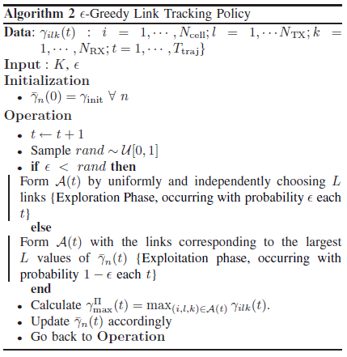
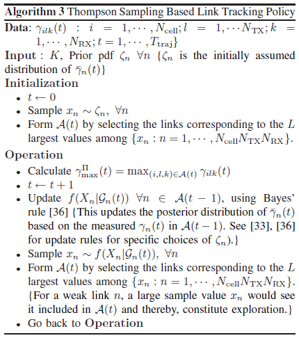
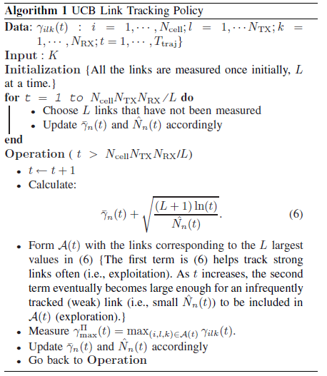
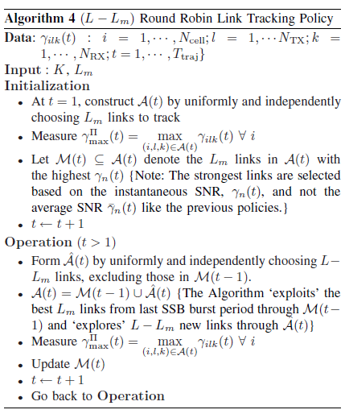

# NR challenge: DRX in Beamforming

## Analysis of 3GPP connected mode DRX

consider a UE situated within the coverage area of $N_{cell}$ gNBs. At the gNB and UE , $N_{tx}$ and $N_{rx}$.

[5G NR DRX框架 - 知乎 (zhihu.com)](https://zhuanlan.zhihu.com/p/625249413)：DRX 属于MAC层，可以根据业务流独立配置

### A. connected Mode DRX concepts Overview

#### BEAM Mangement

Connected Mode DRX中，UE会周期性地唤醒一下任务：
1.波束管理（由图1左侧面板中的波束测量和反馈部分表示），它确定UE保持与网络连接的链路
2.通过 (a) 中的至少一个链接接收通知下行链路上的数据到达（由表示
图 1 中的持续时间段）

单独关注（a），提请注意波束管理过程的功率密集型特性，如果 UE 跟踪所有允许的链路，这会破坏 DRX 作为节能机制的有效性。3 为了减少波束管理引起的功耗，我们考虑识别“良好”子集的策略 '链接到跟踪，而不会危及 UE 接收任何传入数据的能力上面的步骤 (b)

#### Directional Tracking Using Synchronization Signals

使用同步信号的定向跟踪：在波束管理期间，我们假设 UE 通过 5G NR 同步信号块 (SSB) [11] 跟踪来自小区的定向信道质量。 在 5G NR 系统中，每个 gNB 周期性地传输一系列 SSB（称为 SSB 突发），扫描一组 TX 方向 [29]，如图 1 的右面板所示。让 T_{SSB} 表示每个持续时间 SSB、T_{SS} 是 SSB 突发周期，N_{SSB} 是每个 SSB 突发周期中扫描的不同 TX 方向的数量，5 这取决于 TX 码本，如图 1 右面板所示。为了节省功率，我们在第 III 节中假设 在每个 SSB 突发周期中，UE 选择跟踪 K 个 N_{SSB} SSB 时隙（参见图 1 的右图，其中 K = 4，N_{SSB} = 8）。 在其他 SSB 时隙期间，UE 可以通过关闭其 RFFE 进入睡眠状态并节省电量。

---

==From 3GPP 38.100==

PDCCH：指示UE在下一次DRX on-duration出现时监听PDCCH；
PDSCH：支持UE的DRX机制用于节能
PCH（寻呼）：支持 UE 不连续接收 (DRX) 以实现 UE 节能（DRX 周期由网络指示给 UE）；

UE Identities：
为了在 DRX 期间节省 UE 功率，使用以下标识：

- PS-RNTI（无线网络临时标识符）：用于确定UE是否需要在下一次连接模式DRX持续时间出现时监视PDCCH。

Paging：
寻呼 DRX 定义为 RRC_IDLE 或 RRC_INACTIVE 中的 UE 仅需要在每个 DRX 周期的一个寻呼时机 (PO) 期间监视寻呼信道（参见 TS 38.304 [10]）。
用于 CN 发起和 RAN 发起的寻呼的 UE 的 PO 基于相同的 UE ID，导致两者的 PO 重叠。 DRX 周期中不同 PO 的数量可通过系统信息进行配置，并且网络可以根据 UE 的 ID 将 UE 分配给这些 PO。

Downlink：
在下行链路中，gNB 可以通过 PDCCH 上的 C-RNTI 为 UE 动态分配资源。 UE 始终监视 PDCCH，以便在启用其下行链路接收时找到可能的分配（活动在配置时由 DRX 管理）。 配置 CA 时，相同的 C-RNTI 适用于所有服务小区。
Uplink：
在上行链路中，gNB 可以通过 PDCCH 上的 C-RNTI 为 UE 动态分配资源。 UE 始终监视 PDCCH，以便在启用其下行链路接收时找到可能的上行链路传输授权（活动在配置时由 DRX 管理）。 配置 CA 时，相同的 C-RNTI 适用于所有服务小区。

UE power Saving：
UE在RRC连接模式下的PDCCH监控由DRX、BA和DCP（DCI with CRC scrambled by PS-RNTI，DCI：Downlink Control Information，CRC： 循环冗余校验）管理
当配置了 DRX 时，UE 不必持续监视 PDCCH。 DRX具有以下特点：

- on-duration：UE 醒来后等待接收 PDCCH 的持续时间。 如果 UE 成功解码 PDCCH，则 UE 保持清醒并启动不活动定时器；
- inactivity-timer：UE等待成功解码PDCCH的持续时间，从PDCCH的最后一次成功解码开始，失败它可以返回休眠。 UE 应在一次成功解码 PDCCH 后重新启动非活动定时器，仅用于第一次传输（即不用于重传）；
- 重传定时器：预计重传之前的持续时间；
- 周期：指定开启持续时间的周期性重复，然后是一段可能的不活动时间（参见下面的图 11-1）；
- active-time：UE监听PDCCH的总时长。 这包括 DRX 周期的“开启持续时间”、UE 在不活动定时器尚未到期时执行连续接收的时间以及 UE 在等待重传机会时执行连续接收的时间。

---

#### Power Model

1. 检测SSB以测量信道质量（波束测量），每个SSB 消耗$P_{BM}^{f_c,BF}$
2. 监听任务，$P_{LS}^{f_c,BF}$
3. 波束报告，$P_{BR}^{f_c,BF}$

$$
P_{RX}^{f_c,BF} = P_{BM}^{f_c,BF} + P_{LS}^{f_c,BF} + P_{BR}^{f_c,BF}
$$

通过UE RFFE(射频前端模组)追踪的总功率如上：？？（UE测的功率？？）

[Ref1](Skrimponis, P., Dutta, S., Mezzavilla, M., Rangan, S., Mirfarshbafan, S. H., Studer, C., … Rodwell, M. (2020). Power Consumption Analysis for Mobile MmWave and Sub-THz Receivers. 2020 2nd 6G Wireless Summit (6G SUMMIT).)

==Remark：== 所有SSB上的波束测量（即追踪最大允许链路数）是迄今为止连接模式DRX中最大的功耗来源，无论载波频率和波束成形如何。

为了降低功耗，限制SSB突发周期中的 awake SSB 时隙UE 可以跟踪的链路数在用 L 表示的每个 SSB 突发周期中。

优化目标：

分别通过28GHz和140GHz 系统级仿真模拟毫米波和太赫兹系统

1. greedy alogrithm  
   
2. Thompson Sampling  
   
3. 置信上界算法  
   
4. round-robin policy  
   

## 相关研究

