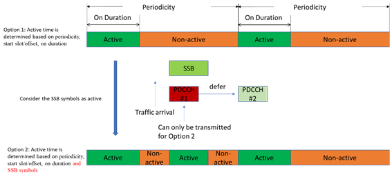

# 2023年5月 NW ES 3GPP RAN1&RAN2

## 1. LS on Cell DTX/DRX activation/deactivation （HUAWEI）

RAN2讨论了Cell DTX/DRX的话题，达成了如下协议：

=>对于 gNB 和 Rel-18 以及传统 UE，空闲/非活动状态下的 RACH、寻呼和 SIB 不会受到影响；
=>支持 Rel-18 NES 的 CONNECTED UE 可以在小区 DTX 和/或 DRX 的非活动期间执行 RACH 和接收 SIB（即，小区 DTX 和小区 DRX 的行为相同）。 不会进一步改进 CBRA （Contention Based RACH）和 CFRA（Contention Free RACH）（这是LTE cell 添加NR Cell 作为Dual Connectivity 过程时发生的过程）；
=>小区 DRX/DTX 的模式配置对于小区中的 Rel-18 UE 是通用的。 FFS（For Further Study） 我们是否有 DTX UE 特定的不活动计时器。 FFS 关于配置信令和第 3 阶段。
=>确认研究项目同意我们可以有单独的 DTX 和 DRX 配置。 我们将专注于为至少单一配置设计 DTX/DRX。 FFS 是否支持小区 DTX 或 DRX 的多种配置；

=>周期性的小区 DTX/DRX 配置被显式通知给 UE。
=>周期性小区 DTX/DRX 模式由 UE 特定的 RRC 信令配置。
=>Cell DTX/DRX配置至少包含：periodicity，start slot/offset，on duration。
=>作为基线，Cell DTX/DRX 由 RRC 信令隐式激活/停用，即一旦 RRC 配置立即激活，一旦 RRC 配置释放则停用。

## 2. Cell DTX/DRX for NES(FutureWei)

研究用于增强小区 DTX/DRX 的 L1 信令，包括具有以下特征的单个配置的激活/去激活：
• 基于PDCCH 的信令
o FFS：是增强传统 DCI 还是引入新的 DCI
o FFS：DCI 内容
o FFS：L1 信令是 UE 特定 DCI 还是组公共 DCI
o FFS：基于计时器或有效持续时间的小区 DTX/DRX 激活/去激活
o FFS：是否指定小区DTX/DRX激活/去激活的参考时间
o FFS：如果要支持多个 Cell DTX/DRX 模式
• FFS 关于接收到 L1 信令时的详细 UE 行为，至少包括应用程序延迟
• FFS如何保证L1信令的可靠性
• FFS L1 信号是否可以在非活动期间进行监控。

在这篇文章中，我们提出了我们对使用 Cell DTX/DRX 提高网络能耗效率的潜在改进的看法。 基于前几节的讨论，在引入对 Cell DTX/DRX 的规范支持时，我们有以下观察要与 RAN2 和 RAN3 分享：
观察 1：在 Cell DTX/DRX 的非活动期间，允许 Rel-18 NES 连接的 UE 接收和发送的信道/信号的数量应保持在最低限度，以最大化网络能量 储蓄收益。
观察 2：可以通过 UE RRC 信令配置通用 DTX/DRX 模式，除了现有的通用 DTX/DRX 模式外，还可以使用 L1/L2 信令来执行以下功能：

- 在一段时间内完全停用配置的模式 DTX/DRX，或者
- 更新的 DTX/DRX 模式被配置为覆盖现有的 DTX/DRX 模式。
  观察 3：==UE DTX 与小区 DRX 的对齐可以通过 gNB 实现作为 gNB 控制的调度 UL 传输的一部分来处理。==
  建议 1：确认工作假设：
- 从 RAN1 的角度来看，支持至少用于激活/停用小区 DTX 和/或 DRX 配置的 L1 信令是可行的（例如，在启用/禁用功能方面）。
  建议 2：应支持第 1 层 UE 组 DCI 或 MAC CE 信令以激活和停用小区 DTX 和/或 DRX 配置。

## 3. Enhancements on cell DTX/DRX Mechanism(Nokia)

**Agreement:** 处理在小区 DTX/DRX 的非活动期间可以重复接收/传输的信号/信道

RAN2会议结果：周期性小区DTX/DRX配置通过特定于UE的RRC信令显式通知给UE，并且至少包含：周期性、起始时隙/偏移、持续时间。

RAN2：Cell  DTX/DRX由RRC信令隐式激活/停用，即一旦RRC配置后立即激活，一旦RRC配置释放则停用。

RAN1：一致认为支持 L1 信令至少用于激活/停用小区 DTX 和/或 DRX 配置是可行的（例如，在启用/禁用功能方面） 从 RAN1 的角度来看。 然而，支持细节，例如是否以及如何支持用于激活/去激活小区 DTX 和/或 DRX 配置的 L1 信令尚不清楚.

RAN1：同意研究用于增强小区DTX/DRX的L1信令，包括针对单个配置的激活/去激活。

具有以下特征：

* PDCCH的信令

  * 是增强传统 DCI 还是引入新的 DCI
  * DCI 内容
  * L1 信令是 UE 特定 DCI 还是组公共 DCI
  * 基于计时器或有效持续时间的小区 DTX/DRX 激活/去激活
  * 是否指定小区DTX/DRX激活/去激活的参考时间
  * 如果要支持多个Cell DTX/DRX模式
  * 在接收到 L1 信令时的详细 UE 行为至少包括应用程序延迟
  * 如何保证L1信令的可靠性
  * 是否可以在非活动期间监视 L1 信号。

### Analysis of cell DTX/DRX impact on UE’s behaviour

#### DCP

一般而言，小区DTX/DRX对UE C-DRX的影响由RAN2来讨论，但是“DCI with CRC scrambled by PS-RNTI”（DCP即C-DRX的唤醒信号）需要RAN1的考虑，因为 该功能在 TS 38.213 中定义。
DCP 使用 DCI 格式 2_6 并在 C-DRX 开启持续时间周期开始之前传输 ps-Offset。 问题是如果DCP监听时机落在小区DTX活动时间之外，但C-DRX On Duration周期落在小区DTX活动时间之内，UE应该做什么。 第一个方面是 UE 是否应该监视 DCP，第二个方面是 UE 是否应该在 C-DRX On Duration 期间醒来。

RAN1 讨论当小区DTX 非活动时间期间发生DCP 监视时机时UE 对DCP 监视的行为和相关动作。

#### SSB

基于 RAN1#112bis-e 讨论摘要 [R1-2304239]，由于公司提出的担忧，以下提案已被讨论，但尚未达成一致。
建议 #1-2B
• 包含SSB 的OFDM 符号和时隙被认为是小区DTX 活动周期的一部分。

我们认为，***即使在小区 DTX 非活动期间，也可以利用活动的 SSB 符号和时隙进行传输，因为 gNB 在该 SSB 符号中无论如何都是清醒的，但不应将其视为活动期间 小区DTX非活跃期，因为这会使小区DTX周期不规则。***

此外，实际上 RRC_CONNECTED UE 中的 UE 可能不会监视 NW 发送的所有 SSB，因此我们不应假设所有 UE 都将监视其他信号/信道传输，例如 PDCCH，与 SSB 时机一致。 这可能对一些关键数据有益，例如 URLLC 流量，但不应成为常规行为，因为它会导致不希望的 UE 和 NW 能量消耗并增加小区 DTX 的实施复杂性。

因此，**我们建议不将包含 SSB 的 OFDM 符号和时隙视为小区 DTX 活动期的一部分，并且 UE 不应期望常规的 NW 行为，而是我们应考虑 NW 可以配置 UE 以监视 DL 在与 SSB Tx 时机复用和/或之后的小区 DTX 非活动期间的传输，例如，在小区 DRX 活动期间接收 UL 传输之后。**
建议 9：包含在小区 DTX 非活动期间下降的 SSB 的 OFDM 符号和时隙不应被视为小区 DTX 活动时段的一部分。
建议 10：***在小区 DTX 非活动期间利用 SSB Tx 时机传输 UE 特定信号/信道应由 NW 基于 UE 进行配置。***

#### DTX Impact

基于 RAN1#112bis-e 会议结果，同意从 RAN1 的角度来看，支持小区 DTX 的 Rel-18 UE 在非活动期间不期望从 gNB 接收和/或处理以下信号/信道cell DTX。 信号/信道列表可以根据 RAN2/RAN4 输入进行更新，并且其他信号/信道不排除进一步讨论。

#### DRX Impact

基于 RAN1#112bis-e 会议结果，同意从 RAN1 的角度来看，支持小区 DRX 的 Rel-18 UE 预计不会在小区 DRX 的非活动期间向 gNB 传输以下信号/信道。 信号/信道列表可以根据 RAN2/RAN4 输入进行更新，并且其他信号/信道不排除进一步讨论。

提案 17：RAN1 讨论是否可以在小区 DRX 非活动期间省略/放宽用于定位的 SRS 监测。 FFS 上的潜在解决方案，以尽量减少对定位程序的影响。
建议 18：当相应的 SPS PDSCH 出现在小区 DTX 活动期间时，应在小区 DRX 非活动期间允许 HARQ 反馈。

## 4.Discussions on enhancements on cell DTX/DRX mechanism(ViVo)

根据上述约定，UE在正常情况下不会在小区DTX的非活跃期监听PDCCH。 但是，还有两个问题需要进一步讨论：
=> Issue 1: 哪些PDCCH在小区DTX的非活跃期不被监听？
=> 问题2：UE需要在小区DTX的非活跃期监听PDCCH的例外情况是什么？
对于 Issue 1，空闲 UE 可以监听的 PDCCH 不应受到影响，例如由 SI-RNTI、RA-RNTI 等加扰的 PDCCH。遵循此规则并考虑对 UE DRX 的类似处理，由 C 加扰的 PDCCH -RNTI、CI-RNTI、CS-RNTI、INT-RNTI、SFI-RNTI、SP-CSI-RNTI、TPC-PUCCH-RNTI、TPC-PUSCH-RNTI、TPC-SRS-RNTI、AI-RNTI不被监听 在正常情况下，由 UE 在小区 DTX 的非活动期间。
对于 Issue 2，以下三个方面应被视为例外情况： 1) RACH 处理； 2）SR待定； 3) 预期重传。
对于CBRA（contention-based random access），在发送了一个contention-based PRACH preamble之后，最终的竞争解决必须通过C-RNTI加扰的PDCCH来解决。 由于 RACH 可以在任何时间传输，将竞争解决延迟到下一个活动时间对 RACH 延迟不利。 因此，在这种情况下，即当 ra-ContentionResolutionTimer 或 msgB-ResponseWindow 正在运行时，UE 需要监视 PDCCH 以完成 CBRA 过程。
对于CFRA（无竞争随机接入），接收由C-RNTI加扰的用于新传输的PDCCH将保证在接收到RAR响应后CFRA过程成功。 因此，在这种情况下，即，当指示寻址到 MAC 实体的 C-RNTI 的新传输的 PDCCH 在成功接收到针对 MAC 实体未选择的随机接入前导码的随机接入响应之后尚未接收到时 基于竞争的随机接入前导码，UE需要监听PDCCH以保证CFRA过程成功。

### UE behavior with both cell DTX and UE C-DRX configured(下行)

=>情况 1：小区 DTX 和 UE DRX 都处于活动状态

* 显然，UE可以正常接收任何信号/信道。

=>情况 2：小区 DTX 处于活动状态且 UE C-DRX 处于非活动状态。

* 在小区 DTX 之后，gNB 可以传输所有 DL 信号/信道。
* 在UE C-DRX之后，PDCCH和CSI-RS可能不会被UE监听。
* 由于 UE C-DRX 被配置为 UE 节能，因此 UE C-DRX 行为应该是这种情况下的基线。

=>情况 3：小区 DTX 未激活，UE C-DRX 激活。

* 一般情况下，UE C-DRX on-duration 应落在小区DTX 的激活周期内。 因此，这种情况主要发生在由于竞争解决或重传定时器运行导致UE C-DRX的活跃期延长时。 这对 UE 的性能很重要。 因此，UE C-DRX 在 PDCCH 监视上的活动期的以下行为是基线。

=> Case 4：小区DTX不活跃，UE C-DRX不活跃。

* 行为相似，但在 CSI-RS 情况下略有不同。 遵循2.2.1中小区DTX非活跃期的行为更有利于网络节能。

### **UE behavior [in non-active period]() of cell DRX（上行）**

用于定位的SRS也可以用于不活跃的UE。 根据当前的 WID，小区 DRX 不会影响 RRC 空闲/非活动 UE。 因此，如果为非活动 UE 配置，gNB 无论如何都会监控用于定位的 SRS。 因此，最好对齐UE在小区DRX的非激活期仍然发送SRS用于定位的行为。
提案10：UE在小区DRX的非活跃期发送SRS用于定位。

=>Case 1：小区DRX和UE DRX都处于激活状态
 显然，UE可以正常传输任何信号/信道。
=>情况 2：小区 DRX 处于活动状态且 UE C-DRX 处于非活动状态。
 由于 UE C-DRX 被配置为 UE 节能，因此 UE C-DRX 行为应该是这种情况下的基线。
=>情况 3：小区 DRX 未激活，UE C-DRX 激活。
 非活跃期跟随小区DRX有利于网络节能
=>Case 4：小区DTX不活跃，UE C-DRX不活跃。
 非活跃期跟随小区DRX有利于网络节能

## 5.**Discussion on cell DTX /DRX(ZTE**)

多小区DTX/DRX模式也有利于NW和UE适应不同的流量模式。 例如，如果如图2(a)所示在cell DTX off期间数据到达，则在cell DTX off期间可能无法及时调度数据，从而导致数据调度延迟到下一个cell DTX on。 为了最小化调度延迟对数据传输的影响，可以考虑使用 L1 信令启用的附加小区 DTX，如图 2 (b) 所示。 因此，可以保证UPT，因为小区DTX on可以动态启用以适应各种数据到达。 对于具有稀疏数据到达的业务模型，还可以考虑在持续时间内动态禁用小区 DTX/DRX。
根据以上分析，激活/去激活多个小区DTX/DRX模式中的小区DTX/DRX模式，例如 switching cell DTX/DRX pattern，应该作为L1信令的指示信息。

## 6. Discussion on enhancements on cell DTX/DRX mechanism(海思)

gNB 可以在不通知 gNB 服务的 UE 的情况下进入微睡眠或轻睡眠。 然而，UE仍然可以接收DL信号/信道（例如，监视PDCCH和接收RS）并发送UL信号/信道。 这对于 UE 而言不是功率高效的。 因此，gNB 最好通知 UE 在一段时间内跳过一些活动。

在上次RAN2会议上，同意在小区DRX[3]的非活动期间不发送SR作为基线。 但是，仍有一些例外情况值得进一步考虑。 一种特殊情况是 SCell BFR 的 SR。** *在当前规范中，当UE检测到小区中的波束失效时，它将启动[BFR](BFR.md)过程。 如图3所示，UE在没有这种类型的SR的情况下无法在小区DRX非活动时间完成SCell BFR过程。 这将导致随机访问过程和对性能的严重影响。*** 正如我们上面提到的，小区DTX/DRX应该不影响基本链路性能，或者最好直接去激活SCell。 因此，建议 SCell BFR 的 SR 不受小区 DRX 的影响。

## 7. DTX/DRX for Network Energy Saving(CATT)

Discussion ： Thealignment of cell DTX/DRX transmission and UE C-DRX

小区DTX/DRX技术可以使小区保持较长时间的休眠状态，而不需要频繁唤醒，有利于网络节能。 当系统负载较低且接入系统的UE数量较少时，用于系统负载平衡的交错C-DRX配置变得不必要。 相反，小区可以通过为所有 UE 分配相同的 C-DRX 配置集（包括 DTX 活动时间和 DTX 非活动时间）来降低低系统负载状态下 DTX 传输的能量消耗。 在 DTX 非活动时间期间，电池可以进入休眠状态以减少能量消耗。
在 RAN2#121bis-e [8] 中，一致认为小区 DTX/DRX 配置至少包含周期性、起始时隙/偏移量和持续时间。 对于 Rel-18 RRC CONNECTED 模式 UE，小区 DTX/DRX 配置参数可以由 gNB 通过 RRC 信令配置。 小区 DTX 周期可以与 UE C-DRX 的周期对齐。 为了不影响在UE C-DRX激活时间之外接收DCI format 2_6，小区DTX激活时间应该早于ps-offset UE监听DCI format 2_6[4]的时间开始，甚至早于 其检测DCI格式2_6的准备时间。 小区 DTX 活动时间将完全覆盖 UE 的 DRX-ON，如图 1 所示。

关于DCI定义：

方案一：配置小区DTX/DRX参数，确保小区DTX/DRX与UE C-DRX对齐，即小区DTX激活时间应完全捕获UE的DRX-ON，至少覆盖接收窗口 DCI 格式 2_6，以便不影响传统 UE。

建议2：如果应用小区DTX/DRX，当小区DTX活动时间结束早于由drx-InactivityTimer、drx-RetransmissionTimerDL或drx-RetransmissionTimerUL中的任一个扩展的UE DRX-ON时，UE行为应该被指定。

### gNB / UE behaviors in cell DTX/DRX

小区 DTX/DRX 机制不应影响 IDLE/INACTIVE UE。 gNB 可以为 UE 发送 SSB 以执行同步和 RRM 测量，以便 IDLE/INACTIVE UE 可以驻留在小区上。 在 RAN2#121 [5] 中，一致认为对于 gNB 和 Rel-18 以及传统 UE，在 IDLE/INACTIVE 中对 RACH、寻呼和 SIB 没有影响。 IDLE/INACTIVE UE可以执行寻呼和RACH过程来接入小区，并且寻呼和RACH过程不受小区DTX/DRX的影响，因为寻呼时机和RACH资源是由网络配置的。

小区 DTX/DRX 行为定义已在 RAN2 [6] 中讨论，并且用于定义小区 DTX/DRX 的四个示例在 RAN2#119bis-e 中达成一致。 示例1是gNB期望在小区DTX/DRX非活动时间期间关闭所有数据流量和参考信号的发送和接收。 在这个例子中，参考信号包含 SSB，它与 WID 冲突，应该排除。

小区DTX/DRX行为定义如下：

* 小区 DTX/DRX 活动时间：gNB 执行与 Rel-17 相同的传输/接收行为。
* 小区DTX/DRX非激活时间：
  ❖ 选项 1：***gNB 预计仅在小区 DTX/DRX 非活动时间内关闭数据流量的发送/接收（即 gNB 仍将发送/接收参考信号）。***
  ❖ 选项 2：gNB 在小区 DTX/DRX 非激活时间内关闭其动态数据发送/接收（即 gNB 仍然在周期性资源中进行发送/接收，包括 SPS、CG-PUSCH、SR、 RACH 和 SRS）。
  ❖ 选项 3：预计 gNB 仅传输参考信号（例如，用于测量的 CSI-RS）。

下行：

上行：

DTX and DRX 配置问题：

在当前的NR系统中，UE的UL和DL传输可以相关或配对，特别是与HARQ操作相关或配对。 如果联合配置小区DTX和小区DRX，则小区DTX活动时间和小区DRX活动时间可以对齐，并且gNB在对齐的gNB活动时间期间服务UL数据接收和DL数据传输以及相应的控制信令。 UL PUSCH 的接收需要具有用于调度 UL 传输的 DL PDCCH。 DL数据传输需要UL控制信令，例如用于链路自适应的CSI和用于HARQ操作的HARQ-ACK反馈。 另外，RRC_CONNECTED UE可以在C-DRX活动时间之外的周期性资源中执行发送/接收，例如， UL CG 和 DL SPS。 小区DTX和小区DRX可以单独配置，小区DTX激活时间和小区DRX激活时间灵活捕获CG/SPS周期资源，避免影响UE传输性能。 由于小区DTX/DRX应用于低系统负载，因此小区DTX和小区DRX单独配置的信令开销是可以接受的。 考虑到对准的小区DTX活动时间和小区DRX活动时间也可以通过单独的小区DTX和DTX配置来实现，单独的小区DTX和DTX配置是灵活的且优选的。

可以配置多个小区DTX/DRX，并且可以通过L1/L2信令或RRC信令来激活/去激活/切换至少一个小区DTX/DRX配置。 此外，可以同时激活多个DTX/DRX配置，并且多个DTX/DRX配置可以用于通过gNB实现来捕获不同的半静态周期性资源，例如CG、SPS等。
建议 6：支持多小区 DTX/DRX 配置。
方案7：通过RRC信令将小区DTX/DRX配置给Rel-18 CONNECTED UE，并使用L1/L2信令或RRC信令激活至少一个小区DTX/DRX配置。

一致同意周期性小区 DTX/DRX 模式由 UE 特定 RRC 信令配置。 周期性小区DTX/DRX可以通过L1/L2信令和UE特定RRC信令来激活/去激活。 在考虑小区DTX/DRX的激活和去激活时，首先要明确这种设计的原理。 ***小区DTX/DRX是主要应用于低系统负载场景的技术。***

从网络节能和UE网络接入性能的角度来看，小区DTX/DRX配置不应该频繁激活或去激活。 此外，小区DTX/DRX技术在最大化网络节能收益的同时，还应考虑UE功耗。 应避免增加UE功耗的小区DTX/DRX的激活和去激活。 因此小区DTX/DRX的激活和去激活需要考虑以下几个方面：

* 小区DTX/DRX是半静态过程，不会频繁激活或去激活。
* 小区DTX/DRX的激活和去激活应该减少对UE功耗的影响。

方案8：小区DTX/DRX的激活和去激活应考虑以下几个方面：

* 小区DTX/DRX是半静态过程，不会频繁激活或去激活。
* 小区DTX/DRX的激活和去激活应该减少对UE功耗的影响。

在 RAN2#121bis-e [8] 中，一致认为，作为基准 Cell DTX/DRX 由 RRC 信令隐式激活/停用，即一旦由 RRC 配置就立即激活，一旦 RRC 配置被释放就停用。 当gNB想要启用或禁用网络节能模式时，gNB可以发送可靠的RRC信令来激活或去激活小区DTX/DRX。

CA 方面：

对于载波聚合（CA）操作，在系统负载较低的情况下，用于数据的活动载波的数量应尽可能少。 从UE省电的角度来看，未使用的SCell可以被去激活或者指示切换到休眠BWP以减少PDCCH监控。 当SCell被去激活或处于休眠BWP时，除了稀疏CSI-RS/正常SSB或周期性CSI报告之外，UE将不会接收/发送数据业务和参考信号。 在这种情况下，小区仍将被激活以发送CSI-RS/正常SSB或接收周期性CSI报告。 当系统处于低负载时，小区DTX/DRX会被考虑增加gNB浅/深睡眠以达到省电的目的。
在RAN2#120 [7]中，一致认为小区DTX/DRX可以针对每个服务小区进行配置，并且可以适用于CA中的不同小区。

## Network Energy Saving on Cell DTX and DRX

当前，UE应当基于配置的周期和时隙偏移在时隙中发送周期性/半持久CSI/波束报告。 然而，在小区DRX的非活动期间，不需要执行周期性/半持久性CSI/波束报告。 gNB 可以在小区 DRX 的非活动期之后触发非周期性 CSI/波束报告。
提议3：***在小区DRX的非激活期间，UE不发送周期/半持久CSI/波束报告。***

波束故障！！！

另一个潜在问题可能是在小区 DRX（例如 RACH、SR 和 BFRQ）的非活动期间由 UE 发起的过程。 由于RACH和SR的大部分过程在RAN2规范中定义，因此研究其在RAN2中的潜在影响更为合理。 RAN1可以研究对BFRQ的潜在影响。 如果UE在声明波束故障后无法发送BFRQ，一种可能的方式是在小区DRX的非活动周期之后发送BFRQ。 然而，如果非激活时间过长，新识别的波束的状态可能会发生变化，并且波束失效的状态也可能会发生变化。 ***然后有必要研究UE是否应该在非活跃期之后重新启动BFD过程或发送BFRQ。***
建议 4：RAN2 应研究来自小区 DRX 非活动期的 RACH 和 SR 过程的影响。
建议 5：研究 BFR 过程对小区 DRX 非活动期的影响。

## 8. Discussion on the cell DTX/DRX

DTX：

***Proposal 3: To reduce the delay caused by the Cell-DTX, the signals/channels related to the retransmission should be an exception.***

DRX：

***Proposal 4: Support UE to stop transmitting the signals/channels not allowed to transmit in the non-active period of Cell DRX.***

### Considerations on alignment with the UE DTX/DRX

Cell DTX/DRX 与 C-DRX 分开配置，有时会发生冲突。 以cell DTX为例，如图1所示，当同样采用C-DRX机制时，UE/Cell可以在on duration中监听WUS，如果cell DTX和on duration之间没有overlap UE，两个UE都不会检测DL信号，例如PDCCH。 更重要的是，UE也可能无法检测到C-DRX的WUS。 另外，如果采用小区DRX，会出现小区在on期间检测到SR等上行信号时，UE却检测不到该SR对应的小区发送的PDCCH调度的情况。

可以考虑两种机制来避免冲突：先检查冲突，然后配置DTX/DRX； 首先配置并激活小区DTX/DRX，然后检查冲突，然后调整配置以避免冲突。 对于第一种机制，如果小区中配置了C-DRX的UE太多，则其可能非常复杂并且很难找到小区DTX/DRX的正确配置。 对于第二种机制，问题是UE/小区如何知道冲突发生，因为UE和小区都处于睡眠模式。
为了避免冲突，我们认为可以引入小区DTX/DRX最长时间的配置。 小区必须在一段时间后被唤醒，以确保来自UE的信号不会丢失太多时间而导致网络性能下降。 如果没有检测到信号/信道，则小区可以返回到DTX/DRX状态。
建议8：
引入小区DTX/DRX最长时间配置，避免与C-DRX冲突

（加入PPT）

## 9.Cell DTX/DRX Configuration for Network Energy Saving

应考虑小区DTX/DRX是否以及如何中断RLM/BFD/BFR相关过程。 在现有规范中，对于休眠的scell，仍然维持波束管理/波束故障检测，以保证gNB/UE能够从scell转为激活时的起始点以适当的波束转入正常的发送/接收过程。 从 UE 的角度来看，小区 DTX/DRX 的特性有点类似于 scell 休眠，***因此在小区 DRX 非活动期间保持一致的 UE 行为以维持 RLM/BFD/BFR 相关过程是合理的，并且相关的周期参考 信号仍应传输***。
建议4：与RLM/BFD/BFR过程相关的周期性参考信号应在小区DTX的非活动期间发送

UCI multiplexing during cell DRX：

在小区 DRX 非活动持续时间期间，可以允许以下的 CSI 报告按优先级顺序在有限的 PUCCH 资源上传输和复用：
• 追踪 – TRS
• RLM
• 光束故障检测/恢复
• 无线资源管理
• 光束管理
当配置了小区DRX时，UE在非活动持续时间期间不发送PUCCH，例如， 用于在 CSI 报告配置中配置的周期性或半持久 CSI-RS。 对UCI复用可能有以下影响：

作为基线，如果小区DRX活动持续时间内的PUCCH与来自非活动持续时间的禁用CSI的PUCCH重叠，则UE可以取消非活动持续时间的CSI传输，并且UE不执行UCI复用。

然而，如果小区DRX非活动的PUCCH在小区DRX活动的重叠PUCCH之前结束，则UE可以首先执行UCI复用，并且可以在小区DRX活动持续时间期间进行传输。

提案9：支持小区DRX非活动期间UCI复用。

## 10.Discussion on cell DTX DRX enhancements（CMCC）

当cell DTX/DRX和UE DRX都被配置时，如果它们不对齐，将会降低节电增益或UE体验。 例如，如图1所示，不同UE的DRX周期不同，或者周期相同但起始偏移量不同，则这些UE将在时间上进行分布式调度。 当配置小区DTX/DRX时，一些UE的激活时间会落在gNB的激活时间之外，那么这些UE将没有机会被调度，除非配置更长的小区DTX/DRX on duration timer，然后功率 小区DTX/DRX的节省增益将受到限制。

因此，为了最大化省电增益，UE C-DRX和小区DTX/DRX的开启持续时间应尽可能重叠。
一种替代方案是重新配置 UE DRX 参数，例如 drx-LongCycleStartOffset，以将 UE DRX 的周期和起始偏移与小区 DTX/DRX 对齐。 但RRC重配置参数生效需要较长的时间。 一旦流量负载增加，gNB 必须再次重新配置这些参数以分配 UE 的活动时间。
另一种选择是使用动态信号。 UE DRX 的对齐可以与小区 DTX/DRX 的 L1 激活和去激活一起完成。 如图2所示，当gNB决定启动小区DTX/DRX时，会发送动态指示通知UE小区DTX/DRX激活，随着动态激活，所有UE都会更新DRX参数，如 DRX周期、drx-startoffset或drx-slotoffset为网络配置的公共起始偏移、公共DRX周期、公共时隙偏移值，或者公共参数与小区DTX/DRX共享相同的值。 如图3所示，所有UE使用与小区DTX/DRX相同的偏移量和周期，并且持续时间定时器可以共享相同的值或不同的值。
通过动态信令方式，gNB 可以对齐 gNB 和 UE 的活动时间，因此可以增加节电增益，并且可以对动态的 UE 流量及时变化做出反应。
所以我们提出以下建议。
提案18：小区DTX/DRX和UE C-DRX的对齐可以动态触发。
提案19：小区DTX/DRX的激活以及小区DTX/DRX与UE DRX的对齐可以共享相同的L1指示信令

## 11.**Discussion on enhancements on cell DTX/DRX mechanism**

在RAN1#112bis-e[2]中，约定在小区DTX/DRX非活跃期间不在DL中接收或在UL中不发送的信号和信道有：
• DL
o 在 CSI-ReportConfig 中的 CSI 报告配置中配置的周期性/半持久 CSI-RS，其中 reportQuantity 包括 RI（用于 CSI 报告）
• UL
o 周期性/半持久性 CSI 报告
o 周期性/半持久性 SRS

## 12.Enhancements on cell DTX/DRX mechanism Lenovo

除了时间/频率跟踪之外，周期性/半持久CSI-RS还用于BM、BFD/BFR、CSI、RRM和RLM。 对于 BM，配置有“重复”的 P/SP CSI-RS 使 UE 能够识别用于传输/接收的最佳 Tx/Rx 波束对，这是更好地接收 PDSCH 和 PDCCH 所必需的。 由于将 BM 的 CSI-RS 静音可能会对 PDCCH 接收产生不利影响，因此我们倾向于将 BM 的 CSI-RS 从信号集中排除在小区 DTX 非活动期间要丢弃的信号之外。
***提案 5 用于 BM 的 CSI-RS 被排除在与小区 DTX 相对应的非活动周期期间静音的信号集中***
与 TRS 类似，如果 BM 的 CSI-RS 被静音，SSB 可以在提供最佳波束对的粗略估计方面发挥类似的作用，以防 UE 配置为报告相应的 SSBRI 作为 CSI 报告的一部分 。
***建议 6 如果 CSI-RS 包含在与小区 DTX 相对应的非活动期间静音的信号集中，SSB 可用于 BM 目的，假设配置了相应的基于 SSBRI 的波束报告***

***提议 7 BM 的 CSI 报告被排除在与小区 DRX 相对应的非活动期间静音的信号集中***

## 13.Enhancements on cell DTX/DRX mechanism(Samsung)

支持者指出，该提案有利于网络节能。 比较以下两个选项以说明该提案的好处。

* 选项1：小区DTX的活动/非活动持续时间确定不受SSB传输的影响，即SSB传输的持续时间可以与小区DTX的非活动持续时间重叠。

- 选项 2：SSB 传输的持续时间被视为小区 DTX 的活动持续时间。

对于选项1，如果SSB传输落在小区DTX的非活动持续时间内，则尽管gNB由于发送SSB而处于活动状态，但UE仍然假设SSB符号为非活动。 对于选项 2，SSB 符号隐式启用额外的活动持续时间。 由于增加了DL传输机会，因此可以减少DL传输的等待时间。 由于增加了具有 UL 授权的 PDCCH 的传输机会，因此还可以减少 UL 调度延迟。 此外，可以减少 DL 传输时间，gNB 可以有更大的概率进入休眠状态。 图 1 中给出了一个示例以供说明。 RAN2 中已同意，即使 UE 处于 C-DRX 活动时间，UE 在 Cell DTX 非活动期间也不监视 PDCCH 以获取新传输的动态授权/分配。 对于选项 1，活动/非活动持续时间是根据商定的参数周期、起始时隙/偏移以及小区 DTX/DRX 配置的持续时间来确定的。 如图 1 所示，DL 流量在 SSB 传输之前到达。 对于选项1，UE将不监视PDCCH#1，如果gNB将发送DL授权，则gNB必须将DL授权的发送推迟到活动符号上的最早的PDCCH MO，例如PDCCH#2。 相反，对于选项2，SSB符号被认为是活动持续时间，并且UE在SSB符号上监视PDCCH，在这种情况下，gNB可以调度PDCCH#1，因此可以避免选项1增加的延迟。 另外，如果在第二周期中没有其他DL传输，则gNB不需要发送任何PDCCH，因此可以在活动持续时间期间进入休眠状态，因此可以通过减少活动RF持续时间来增加网络节能增益。 为了减少第2周期PDCCH的盲检测，还可以采用调度DCI中开启时长的动态指示。 如果在给定的活动持续时间内没有针对UE的DL许可，则可以通过DCI格式来指示UE不监视PDCCH。 从网络的角度来看，将包含 SSB 传输的时隙视为活动时隙有利于调度的灵活性。

## >>> 已经不知道谁家的提案了

提案5 如何对齐不同UE的DRX周期或偏移量需要进一步研究。
此外，在当前规范中，尽管UE在DRX非活动时间期间不监听PDCCH，但是它仍然可以根据配置的资源（例如，使用PUCCH、RACH、SR或CG-PUSCH）执行UL传输。 因此，NB在UE的DRX非活动时间内仍然无法完全关闭部分或全部无线进入NES状态。 因此，将UE DRX与小区DTX和多个UE之间的DRX对齐是有益的。

## 13.松下

当配置UE C-DRX时，为了网络节能，理想情况下，所有RRC CONNECTED UE的DRX可以通过网络实现尽可能地对齐。 然后可以实现小区DTX/DRX的最大gNB睡眠机会。 然而，根据UE和业务负载、频率资源、信道条件和MIMO方案，这可能导致对齐的DRX活动时间中的资源拥塞。 这可能会导致系统性能下降。
***观察1：当配置UE DRX时，所有UE DRX配置和小区DTX/DRX的严格对齐可能会导致资源拥塞。***
因此，在实践中，UE C-DRX和小区DTX/DRX之间的对齐可以通过以半同步或准同步的方式对UE进行适当的配置来实现，从而可以在系统级创建一些“睡眠”时隙， 而 UE 仍然可以在不那么拥挤的时隙中完成 DL/UL 流量，如图 1 所示。 这允许网络更有弹性地在尽可能少的时隙中安排和聚合UE流量调度，但同时确保网络节能、UE功率节省和系统性能之间的折衷。 因此，为了灵活地适应流量并对齐 UE DRX 和小区 DTX/DRX，可以考虑具有不同参数集的多个 UE C-DRX 配置。 此外，配置之间的切换需要可能的 L1/L2 信令增强。
建议七：可以考虑多UE DRX配置，更灵活适配，实现小区DTX/DRX对齐。 配置之间的切换需要可能的 L1/L2 信令增强。

## Final

在潜在信号/信道的列表中，RAN2 已经决定了对一些信号/信道的影响。主持人建议进一步讨论 RAN2 协议目前未涵盖的信号/信道列表。 以黄色突出显示。

从 RAN1 的角度来看，支持小区 DTX 的 Rel-18 UE 不希望在小区 DTX 的非活动期间接收和/或处理来自 gNB 的以下信号/信道。 信号/信道列表可以根据 RAN2/RAN4 输入进行更新，并且其他信号/信道不排除进一步讨论。
•（现有的 RAN1 协议）在 CSI-ReportConfig 的 CSI 报告配置中配置的周期性/半持久性 CSI-RS，报告数量包括 RI（用于 CSI 报告）
• 由measObjectNR 配置的服务小区的CSI-RS
• 与RLM 配置关联的CSI-RS
• 与波束故障检测相关的CSI-RS
• CSI-RS 配置为 TRS-info 设置为 true
• PRS

关于同步问题：

我们认为可以先指定小区DTX/DRX非活跃期间的UE行为，然后考虑如何合并C-DRX，以及是否需要额外考虑一些特殊情况，例如重传定时器如何影响 UE/gNB 行为
