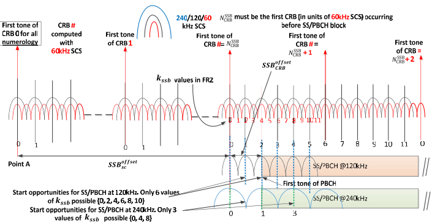

# SSB

SSB 是携带用于==下行链路==同步的特定信号。
SSB的组成部分：PSS主同步信号，SSS辅同步信号和PBCH
SSB在频域的位置：可变（可配置），意味着"无需位于中心频率"
连续SSB的最大数量：4或8或64（FR1为4或8，FR2为64）
连续SSB的主要用途：波束管理（即在不同的波束中传输每个SSB）

SS 块（SSB）代表同步信号块，实际上它指的是同步/PBCH 块，因为同步信号和 PBCH 信道被打包为始终一起移动的单个块。该块的组成部分如下：
同步信号：PSS（主同步信号）、SSS（辅同步信号）
PBCH：PBCH DMRS 和 PBCH（数据）

SS/PBCH 集中的 SS/PBCH 传输被限制在 5 ms 窗口内。SS/PBCH 组内（即 5ms 周期内）的 SS/PBCH 最大数量指定为4（频率范围高达 3 GHz ）、8（3 至 6 GHz）或64（6 至 52.6 GHz），以便实现覆盖范围和资源开销之间的权衡。此外，实际发送的SS/PBCH的数量是可配置的并且可以小于最大数量。此选项对于减少 gNB 的处理负担特别有用，特别是在需要在一个时隙内的多个载波上传输多个 SS/PBCH 的情况下。

SSB BitMap：根据网络要求，它可以选择性地仅发送几个SSB，并通知UE哪些SSB被发送以及哪些不被发送。

SSBlot 集中的每个 SSBlock（即 SSB 传输的 5 ms 周期内的所有 SSblock）都分配有一个从 0 开始并以 1 递增的唯一编号。该编号在下一个 SS Block Set 中重置为 0（即，SSB传输周期（例如，20ms）之后的下一个5ms跨度。这个唯一编号（即，SSBlock索引）通过两个不同的SSBlock内通知给UE。

一部分由PBCH DMRS承载（i_SSB参数）  
另一部分由PBCH Payload承载。

SSB波束扫描：

i) 多个SSB以一定的间隔传输。

ii) 每个 SSB 都可以通过一个称为 SSB 索引的唯一编号来标识

iii) 每个 SSB 均通过向特定方向辐射的特定波束进行传输

iv) 多个UE位于gNB周围的不同位置。

v) UE测量其在特定周期（一个SSB集的周期）内检测到的每个SSB的信号强度。

vi) UE可以从测量结果中识别出信号强度最强的SSB索引。信号强度最强的这个SSB是UE 1的最佳波束。（例如，Beam #1是最佳波束（UE1选择的波束，Beam#7是UE 2的最佳波束）

NR的资源网格

时域资源分配

