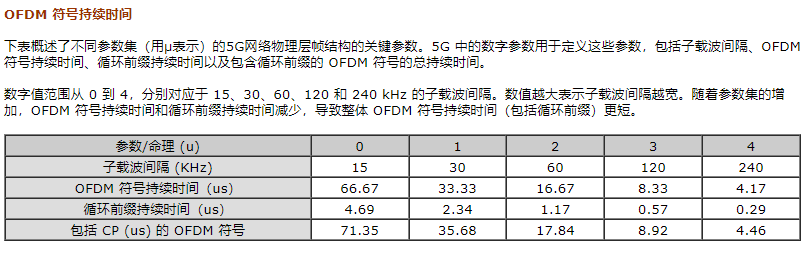
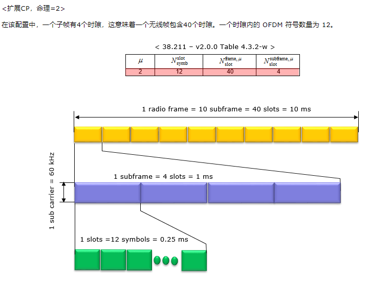

# 帧结构

参数集是指定义物理层结构的一组参数，具体而言，是 OFDM 系统中的子载波间隔、符号持续时间和循环前缀长度。

与 LTE 编号（子载波间隔和符号长度）相比，您可以注意到的最突出的差异是 NR 支持多种不同类型的子载波间隔（在 LTE 中只有一种类型的子载波间隔，15 Khz）。38.211 中总结了 NR 类型的命理，我将表格转换为插图，以便让您直观地了解这些命理。

采样时间可以根据数字（即子载波间隔）来不同地定义，并且在大多数情况下使用两种类型的定时单元Tc和Ts。

TC = 0.509 纳秒
Ts = 32.552 纳秒

如上所述，在 5G/NR 中，支持多种参数（如子帧间隔的波形配置），并且无线帧结构根据参数的类型而略有不同。然而，无论数字如何，一个无线帧的长度和一个子帧的长度是相同的。无线帧的长度始终为 10 ms，子帧的长度始终为 1 ms。 

那么应该怎样做才能适应不同命理的物理属性呢？答案是在一个子帧内放置不同数量的时隙。数字命理学还有另一个不同的参数。它是一个时隙内的符号数量。然而，时隙内的符号数量不会随编号变化而变化，它仅随时隙配置类型而变化。对于具有普通 CP（循环前缀）的时隙，一个时隙的符号数始终为 14，而对于具有扩展 CP 的时隙，一个时隙的符号数始终为 12。

用项目符号总结一下：

无论参数集如何，一个无线帧（10 ms）和一个子帧（1 ms）的长度保持一致。
通过改变一个子帧内的时隙数量来适应不同参数的物理属性。
具有普通循环前缀 (CP) 的时隙始终包含 14 个符号，而具有扩展 CP 的时隙始终包含 12 个符号

