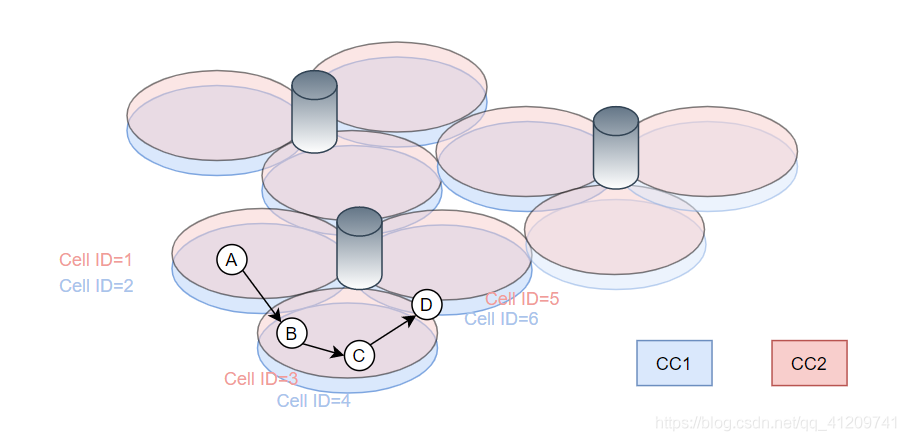

# CA (载波聚合)

## CA基本概念

CA也就是我们中文所说的载波聚合，同时支持多个LTE的载波，这样就能达到更高的传输速率，来满足用户对于速率的要求。
分类
DL CA：-Inter CA
       -Intra CA -连续
                 -不连续
带间（Inter）CA，当两个或者多个不同的载波在不同的频段的时候，既不同Band的组合：4A2A，Band4和Band2的组合，显然不连续。
带内（Intra）CA，当两个或者多个在相同频段的时候，既相同Band的组合。

## PCell and Scell

每个CC对应的都具有独立的Cell。==配置CA的UE一个Pcell最多和4个Scell相连。==而Ue的Pcell和Scell组成了该UE所有Serving Scell集合。

### PCell（Primary Cell）

主小区： 是UE进行初始连接建立的小区，或进行RRC连接重建的小区，或是在handover过 程中指定的主小区。PCell负责与UE之间的RRC 通信。PCell对应的载波单元称为 PCC（Primary Component Carrier）。其中，PCell的下行载波称为DL PCC， PCell的上行载波称为UL PCC。

PCell 是在连接建立（connection establishment）时确定的。SCell 是在初始安全激活流 程（initial security activation procedure）之后，通过 RRC 连接重配置消息 RRCConnectionReconfiguration 添加/修改/释放的。

对于Pcell的初始信息，可以在SIB2中的ul-CarrierFreq和ul-Bandwidth字段中看 到，可以指定下行Pcell对映的上行PCC（仅针对FDD） 。而TDD是没有这些信息的。

### Scell（Secondary Cell）

辅小区： 是在 RRC 重配置时添加的，用于提供额外的无线资源，SCell 与 UE 之间不存在任何 RRC 通信。SCell 对应的载波单元称为 SCC（Secondary Component Carrier）。其中， SCell 的下行载波称为 DL SCC，SCell 的上行载波称为 UL SCC。

## 部署场景

场景1：

例如，假设在A点处，选择小区 ID 1 作为 PCell，并通过 PCell 添加小区 ID 2 作为 SCell。 当UE 移至 B 点时，它将经历一个切换（HandOver）过程，在此过程中，目 标 PCell 成为小区ID 4。
可以假设 eNB 决定在切换过程中不添加任何 SCell，并且在点 C 将小区ID 3 添加为 SCell。

场景2：

运营商具有不同频带的带宽，并且CC1 和 CC2 被部署为位于同一位置并重叠的 CC。 但是，CC2 在较高的频带上，因此由于较大的路径损耗而具有较小的覆盖范围。 CC1 提供足够的覆盖范围，而 CC2 用于提高吞吐量。
在这种情况下有两种方案：

* 方案 1 –网络选择较低频率的 CC 作为 PCC
* 方案 2 –网络选择频率较高的 CC 作为 PCC，即会有更多HandOver操作

场景3：
通过载波聚合降低小区边缘效应 。载波聚合可用于增加小区边缘的吞吐量（例如，CC1和CC2并置，但CC2天线指向 CC1的小区边界）。

场景4：

带有远程无线电头端（RRH）的载波聚合。

## Handover / measurements

* 流动性管理（HandOver）

  * PCell 只能通过网络控制的切换来更改。
  * 没有针对 SCell 的切换。
  * HandOver是带有移动性控制信息的 RRCConnectionReconfiguration 消息。

* 测量报告（Measurements）
  * Rel8 的测量事件适用于配置了载波聚合的UE。
  * 每个测量 ID 最多有一个服务小区（PCell 或 SCell）。
  * 新的测量事件 A6 被定义为“相对于 SCell，频率内变得比偏移更好。”
  * Rel10中针对载波聚合修改了一些测量事件的定义。

## Scell 激活

