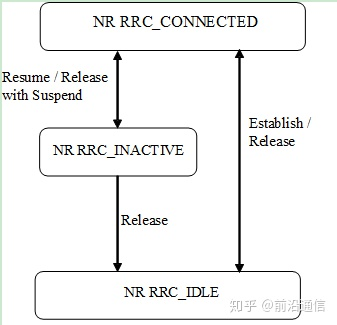

# RRC 状态

在5G网络中，定义了三种RRC状态，相比LTE新增了RRC_INACTIVE状态，三种状态的相互转化关系如下：

## RRC_IDLE状态

* UE特定DRX可以由上层配置；
* 基于网络配置的UE移动性；
* UE的动作：

1. 监控通过DCI通过P-RNTI传输的短消息；

2. 使用5G-S-TMSI监视用于CN寻呼的寻呼信道；

3. 执行相邻小区测量和小区（重新）选择；

4. 获取系统消息并可以发送SI请求（如果配置）。

5. 记录可用测量以及记录测量配置UE的位置和时间。

## RRC_INACTIVE状态

* UE特定DRX可以由上层或RRC层配置；
* 基于网络配置的UE控制移动性；
* UE存储接入层的不活动上下文；
* RRC层配置基于RAN的通知区域；

UE动作：

1. 监控通过DCI通过P-RNTI传输的短消息；

2. 使用5G-S-TMSI监视CN寻呼信道，并使用fullI-RNTI运行寻呼；

3. 执行相邻小区测量和小区（重新）选择；

4. 定期执行基于RAN的通知区域更新，并且当移动到配置的基于RAN的通知区域之外时；

5. 获取系统信息并可以发送SI请求（如果配置）。

6. 记录可用测量以及记录测量配置ue的位置和时间。

## RRC_CONNECTED的状态

* UE存储AS上下文；
* 向或从UE传送单播数据；
* 在低层，UE可以配置有UE特定的DRX；
* 对于支持CA的UE，使用与SpCell聚合的一个或多个SCells以增加带宽；
* 对于支持DC的UE，使用与MCG聚合的一个SCG来增加带宽；
* 网络控制的NR内和E-UTRA之间的移动性；

UE的动作：

1. 通过DCI监控携带P-RNTI短消息的传输；

2. 监视与共享数据信道相关联的控制信道，以确定是否为其调度了数据；

3. 提供信道质量和反馈信息；

4. 执行相邻小区的测量和测量报告；

5. 获取系统信息。

NR中引入RRC_INACTIVE状态的目的是减少控制面使用并达到终端省电的目的，终端处于RRC_INACTIVE状态时，终端保留了最后一个服务小区里工作的上下文，并且允许终端在一定的范围内移动而不需要通知网络他在哪个小区。网络侧保持了NG接口连接，并且和UE一起保留了NAS信令连接，所以，UE只需要进行RESUME过程来恢复信令承载（SRB）和数据承载（DRB），然后就可以开始直接发送或者接收数据，所以NR系统的控制面时延就变成了RRC连接恢复过程的时延。而RRC连接恢复过程在MAC层的随机接入过程结束的时候（也就是在MSG5上完成RRC CONNECTION RESUME COMPLETE消息后就可以接收或发送第一个数据包）。
