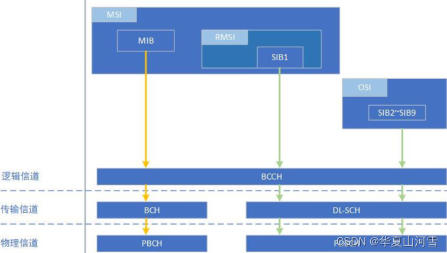
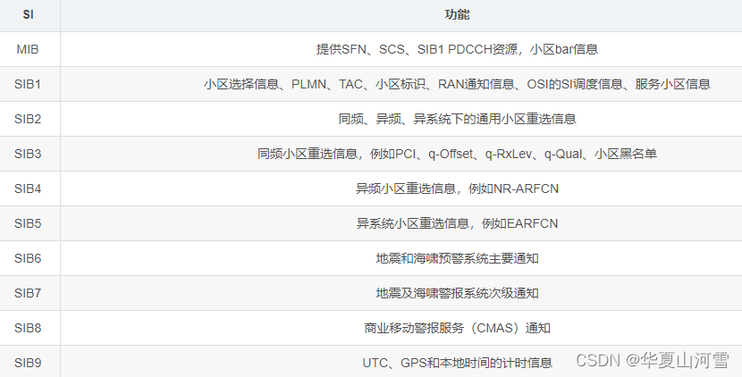

# 系统信息分类

在5G高层中，系统信息可以分为三类：

最少系统信息（Minimum System Information，MSI）：

* MSI包括MIB和RMSI
* MIB的RRC消息 MasterInformationBlock
* MIB信息通过BCH和PBCH信道传输，传输模式为TM
* MIB 对应的 RRC 参数;

剩余最少系统信息（Remaining Minimum System Information，RMSI）:

* RMSI包括SIB1
* SIB的RRC消息 SystemInformationBlock1
* SIB1信息通过DL-SCH和PDSCH信道传输

其它系统信息（Other System Information，OSI）：

* OSI包括SIB2 ~ SIB9
* SIB2 ~ SIB9被封装在一个称为 SystemInformation 的通用RRC消息中
* SIBs信息通过DL-SCH和PDSCH信道传输
注：
(1) MSI是周期性广播的，而OSI可以由网络触发或根据终端请求，以广播或以专用方式提供。
(2) 当终端需要OSI时，在发送OSI请求之前，终端需要知道在当前小区内需要的OSI是否可以获得，是否可以被广播。
(3) 当UE处于RRC_IDLE或RRC_INACTIVE时，UE能够在不需要状态转移的情况下请求OSI；对于处于RRC_CONNECTED的UE，可以使用专用的RRC信令来请求和反馈OSI；
(4) OSI可以在一定的时间内，按照配置的周期进行广播。OSI是通过广播还是通过UE专用的RRC信令反馈，这是由网络决定的。

